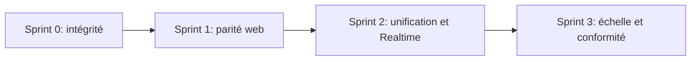

# Plan de remédiation de la messagerie

## Principes d’exécution
- Sprints de deux semaines, avec le Sprint 0 traité comme un correctif prioritaire de 2 à 3 jours.
- Chaque sprint doit rester déployable indépendamment derrière le feature flag `MESSAGING`.
- Les changements Supabase sont livrés par migrations, validés par tests RLS et vérifiés avec les advisors avant déploiement.

## Sprint 0 — Sécuriser l’intégrité et la production
**Objectif : supprimer les possibilités de falsification et de modification des messages.**

- [x] Ajouter une migration limitant les INSERT authentifiés à `text` et `image`; réserver les types système aux RPC atomiques et au `service_role`, à partir de [00014_rls_conversations_messages.sql](/Users/Antonin/development/pokemarket/apps/web/supabase/migrations/00014_rls_conversations_messages.sql) et [00044_fix_messages_rls_and_types.sql](/Users/Antonin/development/pokemarket/apps/web/supabase/migrations/00044_fix_messages_rls_and_types.sql).
- [x] Remplacer l’UPDATE libre des accusés de lecture par une RPC batch ou un trigger garantissant que seul `read_at` change.
- [x] Corréler les RPC transactionnelles à la bonne conversation et forcer `get_inbox` à utiliser `auth.uid()`.
- [x] Retirer la télémétrie locale de [use-realtime.ts](/Users/Antonin/development/pokemarket/apps/web/src/hooks/use-realtime.ts) et de l’error boundary concernée.
- [x] Ajouter des tests négatifs : faux `payment_completed`, modification de `content`, lecture hors conversation, mauvais `conversation_id`.

**Sortie attendue :** aucun participant ne peut fabriquer un état métier ou altérer un message existant.

## Sprint 1 — Rétablir la parité et la confiance sur le web
**Objectif : éliminer les ruptures visibles entre mobile et web.**

- [x] Implémenter l’envoi d’image web dans [message-input.tsx](/Users/Antonin/development/pokemarket/apps/web/src/components/messages/message-input.tsx), avec compression, upload privé et notification liée à un message réellement créé.
- [x] Ajouter le rendu par URL signée et une lightbox dans [message-bubble.tsx](/Users/Antonin/development/pokemarket/apps/web/src/components/messages/message-bubble.tsx).
- [x] Conserver les bulles échouées et proposer un retry dans [page.tsx](/Users/Antonin/development/pokemarket/apps/web/src/app/(protected)/messages/[conversationId]/page.tsx), sur le modèle de [use-conversation-thread.ts](/Users/Antonin/development/pokemarket/apps/mobile/hooks/use-conversation-thread.ts).
- [x] Porter `client_id`, réponses citées, copier et groupement visuel des rafales sur le web.
- [x] Corriger la hauteur du thread desktop, ajouter le bouton de retour au dernier message et remplacer le spinner de pagination par un skeleton.
- [x] Compléter l’accessibilité : labels du composer, annonce des nouveaux messages, reduced motion et zoom navigateur autorisé.

**Sortie attendue :** texte, images, réponses et erreurs réseau se comportent de façon cohérente sur les deux plateformes.

## Sprint 2 — Unifier les flux et fiabiliser le temps réel
**Objectif : réduire la divergence technique et assurer la reconnexion.**

- [x] Unifier web et mobile derrière un contrat d’envoi unique couvrant texte, image, `client_id`, `reply_to`, validation, feature flag et notifications.
- [x] Appliquer un rate limit par utilisateur et conversation à [send/route.ts](/Users/Antonin/development/pokemarket/apps/web/src/app/api/messages/send/route.ts) et [notify-image/route.ts](/Users/Antonin/development/pokemarket/apps/web/src/app/api/messages/notify-image/route.ts).
- [x] Porter sur le web le registry Realtime ref-counté du mobile, consolider INSERT/UPDATE dans un canal par thread et gérer `visibilitychange`/reconnexion.
- [x] Respecter `notification_preferences` avant chaque push et aligner les réglages web/mobile.
- [x] Ajouter des tests d’intégration pour déduplication optimiste, reconnexion, read receipts, pagination et préférences push.
- [x] Instrumenter latence d’envoi, taux d’échec/retry, nombre de canaux actifs et délai Realtime dans Sentry.

**Sortie attendue :** un pipeline unique, observable, limité contre le spam et résilient aux changements réseau.

## Sprint 3 — Préparer le produit à l’échelle
**Objectif : traiter modération, conformité et performance longue durée.**

- Paginer `get_inbox` par curseur et ajouter les index nécessaires; charger progressivement la liste de conversations.
- Ajouter blocage utilisateur et signalement de message/conversation, puis appliquer ces règles aux INSERT, inbox et notifications.
- Implémenter la rétention annoncée d’un an, le nettoyage des pièces jointes orphelines et une procédure d’effacement/anonymisation de compte.
- Construire la vue master-detail desktop et ajouter recherche, archivage/mute et statut transactionnel dans l’inbox.
- Effectuer des tests de charge sur inbox, historique, Realtime et compteurs de non-lus; ne planifier partitionnement ou dénormalisation qu’à partir des résultats.

**Sortie attendue :** messagerie modérable, conforme et mesurée pour la cible 100k+ MAU.

## Ordre de livraison

## Critères globaux de fin
- Tests RLS, API, composants et parcours cross-platform passants.
- Aucun bouton inactif ni message optimiste perdu silencieusement.
- Pas de type système insérable par un client authentifié.
- Reconnexion vérifiée après veille, changement réseau et retour au premier plan.
- Métriques et alertes disponibles avant élargissement du déploiement.