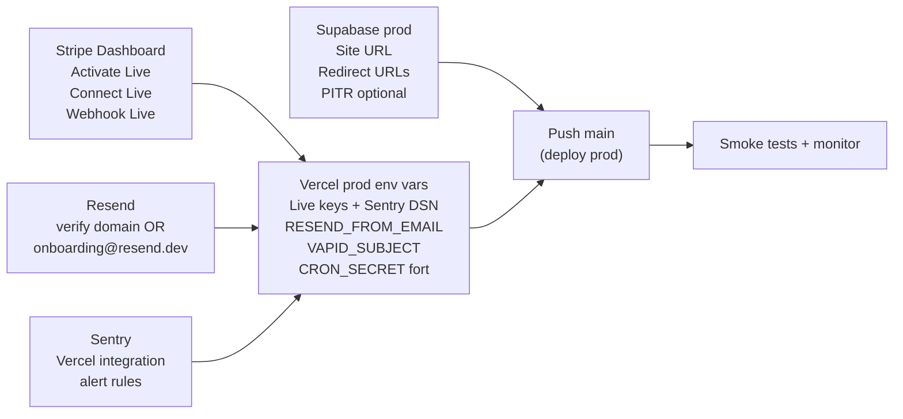

# CI/CD — PokeMarket

Pipeline complete pour 3 environnements : **dev local / staging / prod**, basee sur GitHub Actions, Vercel et Supabase.

> Ce document decrit a la fois la configuration **automatisee dans le repo** (workflows, hooks, fichiers) et les **etapes manuelles** que tu dois executer une seule fois sur les dashboards (Supabase, Vercel, GitHub).

---

## 1. Architecture cible

```text
                                                                  +----------+
                                                                  | Sentry   |
                                                                  | releases |
                                                                  +----------+
                                                                       ^
                                                                       |
+----------------+      PR     +-------------+    PR    +--------------+--+
| feature/* fix/*| --release-> | branch:     |  release | branch:         |
| local dev      |             | staging     |    -->   | main            |
+----------------+             +-------------+          +-----------------+
        |                            |                         |
        |  npm run dev               | Vercel (auto)           | Vercel (auto)
        |  supabase start            | -> staging URL          | -> prod URL
        v                            |                         |
   localhost:3000                    | GitHub Actions          | GitHub Actions
   localhost:54321                   | -> supabase db push     | -> supabase db push
   (Docker Supabase)                 |    (staging project)    |    (prod project)
                                     |                         | -> Sentry release
                                     |                         | -> smoke tests
                                     v                         v
                            +-------------------+    +-------------------+
                            | Supabase staging  |    | Supabase prod     |
                            | (Free tier)       |    | (Pro tier)        |
                            +-------------------+    +-------------------+
```

**Branche `staging`** = source de verite pour la pre-prod.
**Branche `main`** = production. Aucun commit direct, uniquement des PR `staging -> main`.

---

## 2. Setup initial (a faire une seule fois)

### 2.1 Creer le projet Supabase staging

1. Va sur [supabase.com/dashboard](https://supabase.com/dashboard) et cree un nouveau projet `pokemarket-staging` en **Pro tier** (meme plan que la prod), region la plus proche de tes utilisateurs (eu-west par defaut).
   - Pourquoi Pro et pas Free : evite l'auto-pause apres 7 jours d'inactivite, donne acces aux backups quotidiens, supprime les limites de bandwidth qui peuvent biaiser les tests de charge.
2. Note les valeurs suivantes (tu en auras besoin) :
   - Project Ref (visible dans l'URL : `app.supabase.com/project/<REF>`)
   - DB Password (definie a la creation)
   - URL : `https://<REF>.supabase.co`
   - `anon` key et `service_role` key (Settings > API)
3. **Backups** : Pro inclut deja des **backups quotidiens automatiques retenus 7 jours** (gratuit). Pour PokeMarket en pre-launch c'est suffisant. **Ne pas activer PITR** pour l'instant — c'est un add-on a ~100 USD/mois pour 7j de retention seconde-par-seconde, qu'on activera au moment du go-live public quand la perte de quelques heures de transactions deviendra critique (cf. checklist section 6).
4. Genere un **Access Token** personnel (une seule fois, partage entre staging et prod) :
   - [supabase.com/dashboard/account/tokens](https://supabase.com/dashboard/account/tokens) > Generate new token > nom `github-actions`
5. Sur ton terminal local, lie le repo au nouveau projet pour la **toute premiere fois** afin d'appliquer les 47 migrations existantes :
   ```bash
   supabase login
   supabase link --project-ref <STAGING_REF>
   supabase db push
   ```
6. Verifie dans le dashboard SQL editor que les tables sont bien presentes.

### 2.2 Creer le projet Vercel staging

1. Sur [vercel.com](https://vercel.com), clique **Add New > Project** et importe le meme repo GitHub.
2. Nomme-le `pokemarket-staging`.
3. Dans **Settings > Git** :
   - **Production Branch** = `staging` (ce projet considere `staging` comme sa "prod")
   - Desactive les Preview Deployments pour les branches autres que `staging` (sinon double deploys avec le projet prod)
4. Dans **Settings > Environment Variables**, copie **toutes** les vars de `.env.local.example` mais avec les valeurs **staging** :
   - `NEXT_PUBLIC_SUPABASE_URL` = URL Supabase staging
   - `NEXT_PUBLIC_SUPABASE_ANON_KEY` = anon key staging
   - `SUPABASE_SERVICE_ROLE_KEY` = service_role key staging
   - `NEXT_PUBLIC_STRIPE_PUBLISHABLE_KEY` / `STRIPE_SECRET_KEY` = **cles Test** Stripe
   - `STRIPE_WEBHOOK_SECRET` = webhook test (configure un endpoint webhook Stripe pointant vers l'URL staging)
   - `OPENAI_API_KEY` = peut etre la meme qu'en prod (avec un quota limite ou un projet OpenAI dedie)
   - `RESEND_API_KEY` = utilise un domaine Resend secondaire ou la sandbox
   - `NEXT_PUBLIC_VAPID_PUBLIC_KEY` / `VAPID_PRIVATE_KEY` = **regenere une nouvelle paire** (`npx web-push generate-vapid-keys`)
   - `UPSTASH_REDIS_REST_URL` / `UPSTASH_REDIS_REST_TOKEN` = base Upstash dediee staging
   - `NEXT_PUBLIC_SENTRY_DSN` = nouveau projet Sentry `pokemarket-staging` (ou meme projet avec env tag)
   - `NEXT_PUBLIC_APP_URL` = `https://pokemarket-staging.vercel.app` (ou ton domaine staging)
   - `CRON_SECRET` = nouvelle valeur aleatoire **differente** de la prod

### 2.3 Renommer / verifier le projet Vercel prod existant

Si le projet Vercel actuel est branche sur `main` : parfait. Sinon :

- Verifie que **Production Branch** = `main` dans Settings > Git
- Verifie que les env vars contiennent les **cles Stripe Live**, le DSN Sentry prod, etc.

### 2.4 Creer la branche `staging`

Depuis ton local :

```bash
git checkout main
git pull
git checkout -b staging
git push -u origin staging
```

### 2.5 Branch protection (GitHub)

Sur **Settings > Branches > Add branch protection rule**, cree deux regles :

**Rule pour `main`** :

- Require a pull request before merging (1 approval, sauf si tu es solo : 0 approval mais require linear history)
- Require status checks to pass : `Lint, Type-check & Test`, `Build`, `E2E`
- Require linear history (squash/rebase only)
- Do not allow force pushes
- Do not allow deletions

**Rule pour `staging`** :

- Meme chose, sans approval obligatoire
- Status checks : `Lint, Type-check & Test`, `Build`, `E2E`

### 2.6 GitHub Environments

Sur **Settings > Environments** :

#### Environment `staging`

- Pas de required reviewers (deploy auto)
- Secrets :
  - `SUPABASE_ACCESS_TOKEN` (token personnel cree au 2.1)
  - `SUPABASE_STAGING_PROJECT_REF`
  - `SUPABASE_STAGING_DB_PASSWORD`
  - `STAGING_APP_URL` = `https://pokemarket-staging.vercel.app`

#### Environment `production`

- **Required reviewers** : toi-meme (ca cree un gate manuel avant chaque deploy prod)
- Optionnel : wait timer de 5 min
- Deployment branches : limite a `main` uniquement
- Secrets :
  - `SUPABASE_ACCESS_TOKEN`
  - `SUPABASE_PROD_PROJECT_REF`
  - `SUPABASE_PROD_DB_PASSWORD`
  - `PROD_APP_URL` = ton domaine prod
  - `SENTRY_AUTH_TOKEN` (genere sur [sentry.io/settings/account/api/auth-tokens/](https://sentry.io/settings/account/api/auth-tokens/), scopes : `project:releases` + `org:read`)
  - `SENTRY_ORG` = `pokemarket` (ou ton org Sentry)
  - `SENTRY_PROJECT` = `pokemarket-web`

### 2.7 Repository secrets (pour les workflows non-environnementaux)

Sur **Settings > Secrets and variables > Actions > Repository secrets** :

- `APP_URL` = URL prod (utilise par les crons GHA existants)
- `CRON_SECRET` = valeur prod (utilise par les crons GHA)
- `GITLEAKS_LICENSE` (optionnel — necessaire seulement pour les organisations payantes)

### 2.8 Activer Secret Scanning et Dependency Graph

Sur **Settings > Code security and analysis** :

- Active **Secret scanning** + **Push protection** (gratuit sur les repos publics, payant prive)
- Active **Dependency graph**
- Active **Dependabot alerts** + **Dependabot security updates**
- Active **CodeQL analysis** : "Default" suffit (sinon le workflow custom fourni dans le repo prend le relais)

---

## 3. Workflows GitHub Actions du repo

| Workflow           | Fichier                                       | Trigger                                    | Job                                                  |
| ------------------ | --------------------------------------------- | ------------------------------------------ | ---------------------------------------------------- |
| CI principal       | `.github/workflows/main.yml`                  | PR + push `main`/`staging`                 | lint, type-check, vitest, format:check, build        |
| E2E                | `.github/workflows/e2e.yml`                   | PR uniquement                              | Supabase local + Playwright                          |
| Migrations staging | `.github/workflows/migrations-staging.yml`    | push `staging` (paths supabase/migrations) | `supabase db push` staging                           |
| Migrations prod    | `.github/workflows/migrations-production.yml` | push `main` (paths supabase/migrations)    | `supabase db push` prod (avec gate)                  |
| Deploy staging     | `.github/workflows/deploy-staging.yml`        | push `staging`                             | Smoke tests post-deploy contre staging               |
| Deploy prod        | `.github/workflows/deploy-production.yml`     | push `main`                                | Sentry release + smoke tests post-deploy contre prod |
| CodeQL             | `.github/workflows/codeql.yml`                | PR + push + schedule                       | Scan SAST                                            |
| Gitleaks           | `.github/workflows/gitleaks.yml`              | PR + push                                  | Detection de secrets                                 |

> Les anciens workflows `cron-housekeeping.yml` et `cron-release-expired.yml` ont ete supprimes : depuis le passage Vercel Pro, les 3 crons (`housekeeping`, `release-expired`, `shipping-reminders`) sont definis directement dans [`vercel.json`](../vercel.json). Le secret repo `APP_URL` n'est donc plus utilise et peut etre retire de Settings > Secrets and variables > Actions.

---

## 4. Strategie de branches et flux release

### Workflow quotidien

```bash
git checkout staging && git pull
git checkout -b feature/ma-fonctionnalite
# ... code ...
git push -u origin feature/ma-fonctionnalite
# Ouvre une PR -> staging via GitHub UI
```

Apres review et CI verte : **squash merge** dans `staging`. Vercel staging deploie automatiquement et les migrations sont appliquees sur Supabase staging.

### Release en production

```bash
git checkout main && git pull
git merge --ff-only staging  # ou via PR staging -> main
git push origin main
```

GitHub Actions :

1. Demande ton approbation manuelle (gate `production` environment).
2. Pousse les migrations sur Supabase prod.
3. Vercel deploie sur la prod.
4. Tag une release Sentry avec les commits associes.
5. Lance les smoke tests contre la prod.

### Hotfix

```bash
git checkout main && git pull
git checkout -b hotfix/critical-bug
# ... fix ...
git push -u origin hotfix/critical-bug
# PR -> main, merge
git checkout staging
git merge main  # back-merge pour eviter la divergence
git push origin staging
```

---

## 5. Couts indicatifs

| Service                           | Free tier suffit ?                   | Cout pre-launch             | Cout post-launch                                  |
| --------------------------------- | ------------------------------------ | --------------------------- | ------------------------------------------------- |
| GitHub Actions                    | Oui (2000 min/mois prive)            | 0 EUR                       | ~0 EUR sauf gros volume                           |
| Vercel Hobby                      | Oui (mais usage commercial interdit) | 0 EUR                       | ~20 EUR/mois (Pro obligatoire au go-live)         |
| Supabase Pro x2 (staging+prod)    | Non (Pro pour les 2)                 | ~50 USD/mois                | 50 USD/mois (backups quotidiens 7j inclus)        |
| Supabase PITR (add-on, optionnel) | -                                    | 0 USD (desactive)           | +100 USD/mois si active au go-live (7j retention) |
| Sentry                            | Free (5k erreurs/mois)               | 0 EUR                       | depend du trafic                                  |
| **Total CI/CD + infra**           |                                      | **~50 USD/mois pre-launch** | **~80 USD/mois post-launch (sans PITR)**          |

> **Backups vs PITR** : Pro inclut deja des **backups quotidiens automatiques 7 jours**, gratuits. C'est suffisant pour PokeMarket pre-launch. **PITR** (Point-in-Time Recovery) permet de restaurer a la seconde pres mais coute ~100 USD/mois pour 7j de retention. A activer **uniquement au go-live public**, quand la perte de quelques heures de transactions Stripe sous escrow devient critique (cf. checklist section 6).

> **Optimisation cout staging** : tu peux remettre staging sur Free tier pour economiser ~25 USD/mois — mais le projet sera mis en pause apres 7 jours sans activite et tu perdras les backups quotidiens. Pour PokeMarket je recommande de garder les 2 projets en Pro (predictibilite + Branching disponible si besoin, voir [`CONTRIBUTING.md`](../CONTRIBUTING.md)).

---

## 6. Checklist go-live (avant ouverture publique)

A passer au peigne fin la semaine avant l'ouverture aux vrais utilisateurs.

### Vercel

1. Upgrade le projet `pokemarket-prod` vers Pro (~20 USD/mois) — **fait**.
2. Migration des 3 crons vers `vercel.json` natif — **fait** (cf. [`vercel.json`](../vercel.json), workflows GHA cron supprimes).
3. Active la protection par mot de passe sur les Preview Deployments du projet `pokemarket-staging` si tu veux le rendre prive.
4. Configure un domaine custom + HTTPS sur le projet prod (optionnel tant que tu utilises `pokemarket-seven.vercel.app`).
5. Installe l'**integration Sentry Marketplace** sur le projet Vercel prod : Settings > Integrations > Browse Marketplace > Sentry. Indispensable pour l'upload automatique des sourcemaps -> stack traces lisibles dans Sentry.

### Supabase prod

1. **Active PITR** (Settings > Database > Backups > Point-in-Time Recovery, +100 USD/mois pour 7j). C'est le moment : la perte de quelques heures de transactions sous escrow devient irrecuperable sans PITR.
2. Verifie que les **Network restrictions** sont configurees si tu veux limiter l'acces direct a la DB depuis tes IPs admin uniquement (Settings > Database > Network Restrictions).
3. Verifie que les RLS policies ne sont JAMAIS desactivees (dashboard > Authentication > Policies).
4. Audit final des `service_role` usages dans `src/app/api/**` : elles ne doivent etre appelees que depuis des Server Actions / API routes verifiant l'auth de l'appelant.
5. Verifie que `Settings > Auth > URL Configuration > Site URL` pointe sur ton domaine prod et que les Redirect URLs autorisees ne contiennent pas `localhost`.

### Stripe

1. Bascule les cles Vercel prod en **Live mode** (`pk_live_*` / `sk_live_*`).
2. Configure le webhook **Live** pointant sur `https://<DOMAIN>/api/webhooks/stripe`.
3. Verifie que Stripe Connect est en **Production** (pas Test).
4. Active la **2FA** sur le compte Stripe.

### Sentry

1. Verifie que `tracesSampleRate` est bien `0.1` en prod (deja fait dans `sentry.*.config.ts`).
2. Configure des **Alert Rules** : nouveaux issues prod, error rate > seuil, performance degradation.
3. Connecte Sentry a Slack/Discord pour les alertes critiques.

### Monitoring externe

1. Configure UptimeRobot / BetterStack pour pinger `https://<DOMAIN>/api/health` toutes les minutes.
2. Configure une alerte si le check renvoie != 200 pendant 2 minutes consecutives.

---

## 7. Troubleshooting

### "supabase db push" echoue avec "remote schema drift"

Quelqu'un a modifie le schema directement dans le dashboard Supabase au lieu de creer une migration. Resoudre :

```bash
supabase db diff -f drift_fix --linked
git add supabase/migrations/
git commit -m "fix: capture drift from dashboard"
```

### Le workflow E2E echoue avec "Cannot find module"

Le cache npm est corrompu. Vider en bumpant le hash de `package-lock.json` ou en relancant le workflow avec "re-run all jobs".

### Sentry release pas creee

Verifier que `SENTRY_AUTH_TOKEN` a bien le scope `project:releases` (pas seulement `project:read`).

### Vercel deploie sur main alors que je veux qu'il deploie staging

Les 2 projets Vercel (`pokemarket-prod` et `pokemarket-staging`) sont lies au meme repo mais ont chacun une `Production Branch` differente. Verifie que le projet staging a bien `Production Branch = staging` dans Settings > Git.

---

## 8. Bascule prod (operations dashboards)

Liste exhaustive des operations a effectuer **dans les UIs externes** (rien de tout ca n'est dans le code) pour passer le projet "tout est prod, plus rien de dev". A faire dans cet ordre.



### 8.1 Stripe

1. Sur le dashboard Stripe, bascule en mode **Live** (toggle en haut a droite).
2. Stripe Connect : verifie que ton compte est active en Production (Settings > Connect settings > Production access). Si tu es encore en Test, complete les informations demandees par Stripe.
3. Genere les cles **Live** (Developers > API keys) :
   - `pk_live_*` -> `NEXT_PUBLIC_STRIPE_PUBLISHABLE_KEY` Vercel prod
   - `sk_live_*` -> `STRIPE_SECRET_KEY` Vercel prod
4. Cree un **webhook Live** (Developers > Webhooks > Add endpoint) :
   - URL : `https://pokemarket-seven.vercel.app/api/webhooks/stripe`
   - Events : `checkout.session.completed`, `checkout.session.expired`, `checkout.session.async_payment_failed`
   - Signing secret -> `STRIPE_WEBHOOK_SECRET` Vercel prod
5. Active la **2FA** sur le compte Stripe.

### 8.2 Vercel — env vars projet `pokemarket-prod`

Settings > Environment Variables, scope **Production** uniquement :

| Variable                             | Valeur                                               | Notes                                           |
| ------------------------------------ | ---------------------------------------------------- | ----------------------------------------------- |
| `NEXT_PUBLIC_APP_URL`                | `https://pokemarket-seven.vercel.app`                | Sans slash final                                |
| `NEXT_PUBLIC_STRIPE_PUBLISHABLE_KEY` | `pk_live_...`                                        | depuis Stripe                                   |
| `STRIPE_SECRET_KEY`                  | `sk_live_...`                                        | depuis Stripe                                   |
| `STRIPE_WEBHOOK_SECRET`              | `whsec_...` du webhook **Live**                      |                                                 |
| `NEXT_PUBLIC_SENTRY_DSN`             | DSN du projet Sentry prod                            |                                                 |
| `RESEND_API_KEY`                     | cle Resend prod                                      |                                                 |
| `RESEND_FROM_EMAIL`                  | `PokeMarket <noreply@<domaine-verifie>>`             | cf. 8.4                                         |
| `NEXT_PUBLIC_VAPID_PUBLIC_KEY`       | regenere via `npx web-push generate-vapid-keys`      | **paire differente** de staging                 |
| `VAPID_PRIVATE_KEY`                  | idem                                                 |                                                 |
| `VAPID_SUBJECT`                      | `mailto:contact@<domaine>` ou ton email personnel    |                                                 |
| `OPENAI_API_KEY`                     | cle prod (idealement projet OpenAI dedie avec quota) |                                                 |
| `UPSTASH_REDIS_REST_URL` / `_TOKEN`  | base Upstash dediee prod                             |                                                 |
| `SUPABASE_SERVICE_ROLE_KEY`          | `service_role` du projet Supabase prod               |                                                 |
| `NEXT_PUBLIC_SUPABASE_URL` / `_KEY`  | projet Supabase prod                                 |                                                 |
| `CRON_SECRET`                        | regenere : `openssl rand -hex 32`                    | utilise par Vercel Cron pour appeler nos routes |

> Aucune valeur ne doit ressembler a `mon_super_secret_12345678` ni contenir `_test_` apres cette etape.

### 8.3 Supabase prod

1. Settings > Auth > URL Configuration :
   - **Site URL** = `https://pokemarket-seven.vercel.app`
   - **Redirect URLs** = retire toutes les entrees `localhost` et `127.0.0.1`. Garde uniquement les domaines staging + prod.
2. Settings > Database > Network restrictions : optionnel, restreint l'acces direct DB a tes IPs admin.
3. Settings > Database > Backups : envisage **PITR** (~100 USD/mois pour 7j de retention seconde-par-seconde) au moment du go-live public — la perte de quelques heures de transactions sous escrow devient irrattrapable sans PITR.
4. Audit final RLS : toutes les tables `listings`, `transactions`, `profiles`, `offers`, `messages` doivent avoir RLS activee.
5. Active la **2FA** sur le compte Supabase.

### 8.4 Resend

Deux chemins possibles, choisis l'un OU l'autre :

**Chemin A (recommande pour le go-live public)** : verifie un domaine.

1. Achete un domaine (Cloudflare Registrar, Namecheap, OVH...).
2. Dans Resend > Domains > Add Domain, ajoute-le et copie les enregistrements DNS (SPF, DKIM, DMARC).
3. Cree-les chez ton registrar, attends la verification.
4. Mets a jour `RESEND_FROM_EMAIL` Vercel prod : `PokeMarket <noreply@tondomaine.tld>`.

**Chemin B (temporaire, pre-launch)** : reste sur le sender de test Resend.

1. `RESEND_FROM_EMAIL=PokeMarket <onboarding@resend.dev>` (valeur par defaut).
2. **Limites** : 100 emails/jour max, et **les emails ne partent qu'a l'adresse rattachee a ton compte Resend**. Aucun utilisateur final ne recevra ses emails (welcome, offre recue, rappel d'expedition).
3. A bascule sur le chemin A des que tu acquiers un domaine — les emails sont indispensables pour les vendeurs (rappel d'expedition, nouvelle offre).

### 8.5 Sentry

1. Dans le dashboard Sentry, projet `pokemarket-web` :
   - Verifie `tracesSampleRate=0.1` en prod (deja fait dans `sentry.*.config.ts`).
   - Cree des **Alert Rules** : nouveaux issues prod, error rate spike, slow transactions p95.
   - Connecte une integration Slack ou Discord pour les alertes critiques.
2. Sur Vercel projet prod : installe l'integration **Sentry Marketplace** (Settings > Integrations) -> upload automatique des sourcemaps a chaque deploy. Le workflow `deploy-production.yml` continue a tagger une release Sentry par-dessus.

### 8.6 GitHub repo

1. Settings > Secrets and variables > Actions : **retire** le secret `APP_URL` (plus utilise depuis la migration crons en 8.2).
2. Garde `CRON_SECRET` en secret repo (utilise par les smoke tests).
3. Active la **2FA** sur ton compte GitHub.

### 8.7 Monitoring externe

1. Configure UptimeRobot ou BetterStack pour pinger `https://pokemarket-seven.vercel.app/api/health` toutes les minutes.
2. Alerte email/Slack si != 200 pendant 2 minutes consecutives.

### 8.8 Validation finale

Apres avoir applique 8.1 a 8.7 :

```bash
# 1. Push staging et verifier que le deploy + smoke tests passent.
git push origin staging

# 2. Tester un checkout Stripe en mode Live avec une vraie carte (rembourse-toi).
#    Verifier que success_url pointe sur https://pokemarket-seven.vercel.app/...

# 3. Verifier que Vercel Cron tourne (Dashboard projet > Cron > derniere execution < 15 min).

# 4. Verifier qu'un email reel part bien (welcome a un nouveau compte).
```
