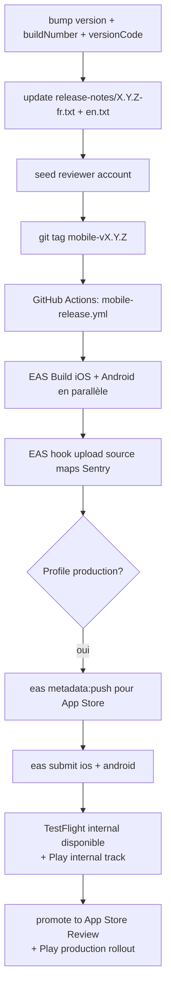

# Mobile release runbook — PokeMarket iOS + Android

> Procédure complète pour livrer une version de l'app mobile en bêta puis
> en production. Couvre EAS Build, EAS Submit, métadonnées App Store /
> Play Store, source maps Sentry et compte reviewer.

## Table des matières

1. [Pré-requis (one-time)](#1-pré-requis-one-time)
2. [Workflow d'une release standard](#2-workflow-dune-release-standard)
3. [Métadonnées stores via EAS](#3-métadonnées-stores-via-eas)
4. [Bêta TestFlight + Play closed track](#4-bêta-testflight--play-closed-track)
5. [Soumission production](#5-soumission-production)
6. [OTA updates EAS Update](#6-ota-updates-eas-update)
7. [Source maps Sentry](#7-source-maps-sentry)
8. [Rollback / hotfix](#8-rollback--hotfix)
9. [Annexes — comptes & secrets](#9-annexes--comptes--secrets)

---

## 1. Pré-requis (one-time)

### Comptes externes

- ✅ **Apple Developer Program** — 99 €/an. Signer en tant
  qu'organisation (pas individuel) pour pouvoir céder l'app plus tard.
- ✅ **Google Play Console** — 25 € one-time.
- ✅ **Expo (EAS)** — un workspace `pokemarket` (free plan suffit pour
  commencer ; passer Production à 99 $/mois si on dépasse 30 builds/mois).
- ✅ **Sentry** — projet `pokemarket-mobile` séparé du web.

### Configuration du projet (déjà en place)

- `apps/mobile/app.json` — bundle id, scheme, plugins, version `1.0.0`.
- `apps/mobile/eas.json` — profils `development` / `preview` / `production`.
- `apps/mobile/store.config.json` — métadonnées App Store Connect.
- `apps/mobile/store/` — copy FR + EN, release notes, reviewer notes,
  privacy labels (cf. `apps/mobile/store/README.md`).
- `apps/mobile/eas-hooks/eas-build-on-success.sh` — upload source maps
  Sentry après chaque build production.
- `.github/workflows/mobile-release.yml` — automation CI sur tag
  `mobile-vX.Y.Z`.

### Secrets à créer

```bash
# 1. EAS — secrets injectés dans les builds
cd apps/mobile

eas secret:create --scope project --name SENTRY_AUTH_TOKEN --value "<token>"
eas secret:create --scope project --name SENTRY_ORG --value "pokemarket"
eas secret:create --scope project --name SENTRY_PROJECT --value "react-native"

# 2. EAS Submit — credentials Apple + Android
#    iOS : créer une "App Store Connect API key" depuis App Store Connect ->
#    Users and Access -> Keys -> "+" puis renseigner ses 3 IDs.
#    Le .p8 doit être placé dans secrets/asc-api-key.p8 (gitignored) ou
#    uploadé via `eas credentials`.
#
#    Android : créer un service account dans Google Cloud Console avec le
#    rôle "Service Account User" + accès "Release manager" depuis
#    Play Console -> Users and permissions, télécharger le JSON dans
#    secrets/play-store-service-account.json (gitignored).

# 3. GitHub Actions — environnement "mobile-production"
# Settings -> Environments -> mobile-production -> Add secret
gh secret set EXPO_TOKEN --env mobile-production --body "<expo-access-token>"
# SENTRY_* : uniquement sur EAS (voir ci-dessus), pas besoin sur GitHub pour eas build
```

### Initialisation EAS (à faire une fois)

```bash
cd apps/mobile
eas login
eas init                # crée le projectId, à committer dans app.json
eas build:configure     # vérifie que eas.json est valide
eas device:create       # iOS only — provisionner les iPhones de la team pour les builds preview ad-hoc
```

Mettre à jour `apps/mobile/app.json` :

```diff
-    "extra": { "eas": { "projectId": "TODO_SET_AFTER_EAS_INIT" } }
+    "extra": { "eas": { "projectId": "<uuid imprimé par eas init>" } }
-    "owner": "TODO_SET_EAS_OWNER"
+    "owner": "pokemarket"
```

Et `apps/mobile/eas.json` (section `submit.production`) :

```diff
-      "ascAppId": "TODO_APP_STORE_CONNECT_APP_ID",
-      "appleId": "TODO_APPLE_ID_EMAIL",
-      "appleTeamId": "TODO_APPLE_TEAM_ID",
+      "ascAppId": "1234567890",
+      "appleId": "ops@pokemarket.app",
+      "appleTeamId": "ABCD1234EF",
```

---

## 2. Workflow d'une release standard



### Étapes manuelles (humain)

1. **Bump versions** dans `apps/mobile/app.json` :

   ```diff
   -  "version": "1.0.0",
   +  "version": "1.0.1",
   ...
   -    "buildNumber": "1",
   +    "buildNumber": "2",
   ...
   -    "versionCode": 1,
   +    "versionCode": 2,
   ```

2. **Release notes** — créer `apps/mobile/store/release-notes/1.0.1-fr.txt`
   et `1.0.1-en.txt` (max ~600 chars chacune, format puces).

3. **Reseed reviewer** (avant chaque submit, pour donner de la donnée
   fraîche à Apple) :

   ```bash
   cd apps/mobile
   npm run seed:reviewer -- --reset
   ```

4. **Tag git** + push :

   ```bash
   git commit -am "chore(mobile): release v1.0.1"
   git tag mobile-v1.0.1
   git push origin main --tags
   ```

5. La CI prend le relais (cf. `.github/workflows/mobile-release.yml`).

---

## 3. Métadonnées stores via EAS

### App Store Connect (automatisé)

`eas metadata:push` lit `apps/mobile/store.config.json` et synchronise :

- titre, sous-titre, description (FR + EN)
- mots-clés
- release notes
- URLs marketing / support / privacy
- catégories
- privacy nutrition labels (à compléter manuellement la 1re fois,
  puis figées dans le formulaire)
- reviewer notes

```bash
cd apps/mobile

# Pull la version actuelle d'App Store Connect (utile pour debug)
npm run metadata:pull

# Validate sans push
npm run metadata:lint

# Push
npm run metadata:push
```

### Play Console (manuel V1)

EAS Submit envoie le binaire mais pas la fiche listing. Pour la 1re
publication, recopier manuellement depuis :

- `apps/mobile/store/play-store/short-description-{fr,en}.txt`
- `apps/mobile/store/play-store/full-description-{fr,en}.md`
- `apps/mobile/store/release-notes/<version>-{fr,en}.txt` (champ
  "Notes de version" pour chaque langue)
- `apps/mobile/store/play-store/data-safety.md` (formulaire **Sécurité
  des données** — à mapper case par case)

> TODO V2 : automatiser via la Google Play Publishing API
> (`androidpublisher.edits.listings.update`).

### Screenshots

Cf. `apps/mobile/store/screenshots/README.md` pour les tailles requises
et la checklist de capture. Utiliser **toujours un build EAS preview
ou production** (jamais Expo Go) pour éviter les artéfacts visuels.

---

## 4. Bêta TestFlight + Play closed track

### TestFlight

1. Build production via la CI ou en local : `eas build -p ios --profile production`.
2. `eas submit -p ios --latest` envoie le `.ipa` à App Store Connect.
3. Dans App Store Connect → TestFlight :
   - **Internal testing** : ajouter les emails de l'équipe (jusqu'à 100
     testeurs gratuits, pas de review Apple). Disponible sous 5-10 min.
   - **External testing** : créer un groupe "Beta publique" (jusqu'à
     10 000 testeurs). Premier build externe doit passer une review
     "beta" (24-48h). Builds suivants : auto-approved.

### Play closed track

1. `eas build -p android --profile production`.
2. `eas submit -p android --latest --track internal` (déjà la valeur par
   défaut dans `eas.json`).
3. Dans Play Console :
   - **Test interne** : ajouter les emails (immédiat, pas de review).
   - **Test fermé** (closed track) : créer un track "Beta publique",
     promouvoir le build interne. Pas de review (juste un check rapide).
   - **Test ouvert** (open track) : promouvoir depuis closed.

### Critères de sortie de bêta

Avant de soumettre en production :

- ✅ ≥ 2 semaines en bêta avec au moins 20 testeurs actifs
- ✅ Crash-free sessions ≥ 99 % sur 7 jours glissants (Sentry)
- ✅ 0 crash dans le top 10 Sentry non-résolu
- ✅ Apple Pay testé sur device physique iOS
- ✅ Google Pay testé sur device physique Android
- ✅ Push notifications testées sur iOS + Android
- ✅ Deep links `https://pokemarket.app/listing/...` testés
- ✅ Compte reviewer reseed et credentials copiés dans
  `app-review notes`

---

## 5. Soumission production

### iOS — App Store

```bash
cd apps/mobile

# 1. Push métadonnées (description, keywords, release notes...)
npm run metadata:push

# 2. Submit le binaire à App Store Connect
npm run submit:ios

# 3. Dans App Store Connect, aller sur la version, vérifier :
#    - Build attaché (peut prendre 5-10 min après upload)
#    - Privacy nutrition labels OK
#    - Screenshots uploadés pour toutes les tailles
#    - Reviewer notes + démo account renseignés
#    - "Submit for Review"
```

Délai review Apple : 24-72 h en général. Surveiller App Store Connect

- inbox `ops@pokemarket.app`.

### Android — Play Store

```bash
cd apps/mobile

# 1. Submit en internal track
npm run submit:android

# 2. Dans Play Console : promote internal -> closed -> open -> production.
#    Pour la 1re mise en prod, faire un staged rollout :
npm run submit:android:prod-track    # rollout 10 % par défaut (cf. eas.json)
```

Délai review Play : 3-7 jours pour la première soumission, < 24 h pour
les suivantes (sauf changement majeur de policy).

### Phased release iOS

`store.config.json` active `phasedRelease: true` → Apple déploie sur
1 % le jour 1, 2 % jour 2, etc. jusqu'à 100 % au jour 7. Permet de
détecter une régression critique avant qu'elle frappe 100 % des users.

---

## 6. OTA updates EAS Update

Pour les fixes JS purs (pas de natif modifié), pas besoin de re-soumettre
aux stores :

```bash
cd apps/mobile
npm run update -- --channel production --message "fix: typo wallet screen"
```

L'update est livrée à tous les devices ouverts dans les ~heures qui
suivent (ou au prochain cold-start). Limite : pas de changement
`expo-camera`, `expo-notifications`, etc., qui touchent du natif.

> ⚠️ Penser à incrémenter `expo.runtimeVersion` côté `app.json` quand on
> bumps un module natif, sinon les anciens binaires recevraient un OTA
> incompatible.

---

## 7. Source maps Sentry

> **Build EAS qui échoue sur `Auth token is required` ?**  
> Le plugin Gradle Sentry s'exécute **sur les serveurs EAS**, pas sur
> GitHub Actions. Il faut créer `SENTRY_AUTH_TOKEN` comme **secret EAS**
> (`eas secret:create` ci-dessus). Les variables `SENTRY_*` passées dans
> le workflow GitHub **ne sont pas** transmises au builder cloud.

Le hook `eas-hooks/eas-build-on-success.sh` upload automatiquement les
source maps **uniquement pour le profil `production`** (en complément de
l'upload Gradle natif, qui requiert aussi `SENTRY_AUTH_TOKEN` sur EAS).

Les profils `development` et `preview` définissent
`SENTRY_DISABLE_AUTO_UPLOAD=true` pour permettre des builds sans token.

Vérifier après un build :

1. Aller sur https://sentry.io/organizations/pokemarket/releases/
2. La release doit apparaître sous le format
   `app.pokemarket.mobile@1.0.0+1` (version + buildNumber/versionCode).
3. Tab **Files** : doit lister `index.android.bundle` ou `main.jsbundle`
   - `.map`.

Si elle manque :

```bash
# Upload manuel
cd apps/mobile
npx sentry-expo-upload-sourcemaps dist
```

L'identifiant `release` côté runtime (cf. `lib/sentry.ts`) doit matcher
exactement celui uploadé. Sinon Sentry affiche les stacks minifiés.

---

## 8. Rollback / hotfix

### Hotfix JS pur

OTA via `eas update` (cf. §6). Quasi-instantané.

### Régression natif (Stripe SDK qui crash, etc.)

1. Bump version + buildNumber + versionCode (`1.0.1` → `1.0.2`)
2. Push tag `mobile-v1.0.2` → CI rebuild + submit
3. iOS : "Expedited Review" demandé via App Store Connect (en cas de
   crash 100 %, Apple traite en quelques heures).
4. Android : staged rollout halt (Play Console → Production →
   "Halt rollout") puis promote la 1.0.2.

### Désactiver une release iOS déjà live

App Store Connect → version → "Remove from sale" (l'app reste pour
ceux qui l'ont, mais nouveaux téléchargements bloqués).

---

## 9. Annexes — comptes & secrets

### Inventaire des secrets (single source of truth)

| Service         | Type                             | Stocké dans                                                                        | Rotation                            |
| --------------- | -------------------------------- | ---------------------------------------------------------------------------------- | ----------------------------------- |
| Apple Developer | App Store Connect API key (.p8)  | `secrets/asc-api-key.p8` (gitignored) + EAS secret                                 | 1 an                                |
| Apple Developer | App-specific password            | EAS secret `APPLE_APP_SPECIFIC_PASSWORD`                                           | sur compromission                   |
| Google Play     | Service account JSON             | `secrets/play-store-service-account.json` (gitignored) + EAS secret                | 1 an                                |
| Sentry          | Auth token (project:write)       | EAS secret `SENTRY_AUTH_TOKEN`                                                     | 6 mois                              |
| Expo            | Access token                     | GH secret `EXPO_TOKEN`                                                             | 1 an                                |
| Stripe          | Publishable + restricted RN keys | `apps/mobile/.env` (gitignored) + EAS env via `EXPO_PUBLIC_STRIPE_PUBLISHABLE_KEY` | sur compromission                   |
| Supabase        | Anon key                         | `apps/mobile/.env` (publique, OK dans le bundle)                                   | jamais (rotation casse les clients) |

### Folder `secrets/` (à la racine du repo)

```
secrets/
├── asc-api-key.p8                       # Apple
├── play-store-service-account.json      # Google
└── README.md                            # qui a accès à quoi
```

→ Doit déjà être dans `.gitignore`. Stocké dans 1Password vault
"PokeMarket Mobile Releases".

### Liens rapides

- App Store Connect : https://appstoreconnect.apple.com/
- Play Console : https://play.google.com/console
- Expo dashboard : https://expo.dev/accounts/pokemarket/projects/pokemarket
- Sentry mobile : https://sentry.io/organizations/pokemarket/projects/react-native/
- Stripe dashboard : https://dashboard.stripe.com/

### Personnes responsables

| Domaine                         | Responsable | Backup |
| ------------------------------- | ----------- | ------ |
| Comptes Apple / Google          | Antonin     | TODO   |
| Releases iOS                    | Antonin     | TODO   |
| Releases Android                | Antonin     | TODO   |
| Reviewer account / Apple Review | Antonin     | TODO   |
| Sentry monitoring               | Antonin     | TODO   |
