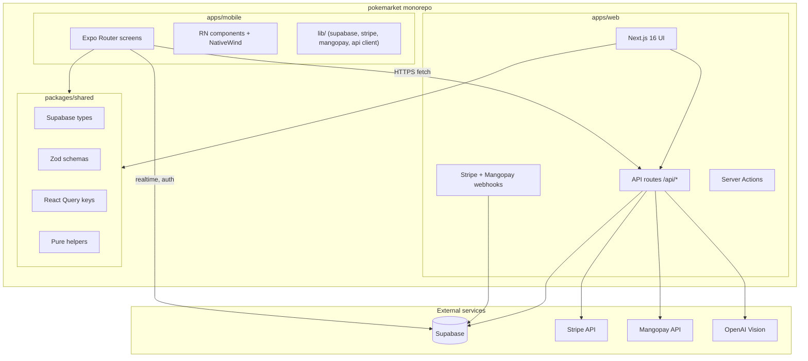

# React Native cross-platform PokeMarket — Plan détaillé

> Plan d'exécution sprint-par-sprint pour livrer une app mobile iOS + Android de PokeMarket avec parité quasi-totale (hors admin), basée sur Expo SDK 54+ dans un monorepo Turborepo qui réutilise le backend Next.js et un package `@pokemarket/shared`.

## Statut d'exécution

| Sprint | Description | Statut |
|--------|-------------|--------|
| 0 | Setup monorepo, Expo, NativeWind, Supabase mobile, EAS | ✅ Complété |
| 1 | Extraction `@pokemarket/shared` (types, validations, constants, query-keys, pricing, utils, mangopay, api-contracts) | ✅ Complété |
| 2 | Auth (4 écrans) + root layout + tab navigator + design system (22 composants UI) | ✅ Complété |
| 3 | Read flows (8 écrans + 12 hooks + composants feed/listing/profile) | ✅ Complété |
| 4 | Messaging realtime + offers (3 écrans, presence, cleanup AppState) | ✅ Complété |
| 5 | Sell flow + OCR caméra + photos (5 composants, 2 écrans, draft AsyncStorage) | ✅ Complété |
| 6 | Couche payments abstraction (Stripe + Mangopay), checkout, payment methods (4 écrans, 3 composants, Bearer auth helper, webhook PaymentIntent) | ✅ Complété |
| 7 | Wallet + KYC WebView + transactions history + sales detail + actions (ship/confirm/dispute) | ✅ Complété |
| 8 | Native polish : push, deep links, biométrie, onboarding, présence, haptics | ✅ Complété |
| 9 | Bêta + ship : screenshots, descriptions, TestFlight, Play Store, soumission | ✅ Artefacts livrés (en attente comptes Apple / Play) |

## 1. Cible et contraintes

- **Scope V1 mobile** : feature parity quasi-totale, hors `apps/web/src/app/(admin)/*` qui reste web-only.
- **Plateformes** : iOS + Android en parallèle, soumission simultanée.
- **Backend** : aucune réécriture. Reste Next.js sur Vercel (`apps/web/src/app/api/*`).
- **Paiements** : pendant la migration Stripe → Mangopay en cours, le mobile supportera **les deux** via une couche d'abstraction côté client. Choix automatique selon la config retournée par l'API.
- **Estimation initiale** : ~5 mois en solo + Cursor à plein temps (10 sprints de 1-3 semaines).

## 2. Architecture cible

## 3. Décisions à prendre AVANT de démarrer (bloquantes)

Ces 4 décisions changent matériellement le plan ; à valider avant Sprint 0 :

- **D1 — KYC mobile** : faire le KYC Mangopay (et l'onboarding Stripe Connect) dans une WebView (`expo-web-browser`) ou natif via deep link retour ? Recommandation : **WebView** (Mangopay n'a pas de SDK mobile officiel, et Stripe Connect onboarding est officiellement supporté en WebView).
- **D2 — Bundle ID & store presence** : confirmer le bundle id (`app.pokemarket.mobile` ?), le nom store ("PokeMarket"), et créer les comptes Apple Developer Program (99 €/an) + Google Play Console (25 € one-time) dès Sprint 0.
- **D3 — Domaine API public** : confirmer l'URL de prod du backend (`https://pokemarket.app/api` ?). Le mobile l'utilisera via `EXPO_PUBLIC_API_URL`. Prévoir aussi staging.
- **D4 — Stratégie auth deep link** : utiliser le scheme `pokemarket://auth/callback` pour les redirects OAuth Supabase + retour Stripe/Mangopay onboarding ? À configurer dans Supabase dashboard avant Sprint 2.

## 4. Sprints

### Sprint 0 — Monorepo + Expo skeleton (1 semaine)

Référence d'exécution : `.cursor/skills/react-native-migration/setup-monorepo.md`.

- Créer la branche `chore/monorepo-migration`
- Convertir le repo en workspaces npm + Turborepo (`turbo.json`, `tsconfig.base.json` à la racine)
- `git mv` du code Next.js vers `apps/web/`
- Créer `packages/shared/` (squelette `src/index.ts` vide)
- `npx create-expo-app@latest mobile --template blank-typescript`
- Installer les dépendances mobile minimales : `expo-router`, `nativewind v4`, `@supabase/supabase-js`, `@react-native-async-storage/async-storage`, `react-native-url-polyfill`, `@tanstack/react-query`
- Configurer `babel.config.js`, `metro.config.js` (workspace-aware), `tailwind.config.js`, `global.css`
- `apps/mobile/lib/supabase.ts` avec adapter AsyncStorage
- Configurer `eas.json` (profils development / preview / production)
- Créer un compte Apple Developer + Play Console (D2)
- Build EAS development client iOS + Android
- **Critère de sortie** : login Supabase + écran "Hello {user.email}" qui marche sur iOS sim + Android emu

### Sprint 1 — Shared foundations (3-5 jours)

Skill : `.cursor/skills/extract-shared-code/SKILL.md`.

Extraire un par un (avec `git mv` + maj des imports) :

- `src/types/database.ts` → `packages/shared/src/types/database.ts`
- `src/lib/constants.ts` → `packages/shared/src/constants/`
- `src/lib/validations.ts` → `packages/shared/src/validations/`
- `src/lib/query-keys.ts` → `packages/shared/src/query-keys/`
- `src/lib/pricing.ts` → `packages/shared/src/lib/pricing.ts`
- `src/lib/shipping.ts` → `packages/shared/src/lib/shipping.ts`
- `src/lib/utils.ts` (helpers purs uniquement) → `packages/shared/src/lib/utils.ts`
- `src/lib/mangopay/types.ts` + `src/lib/mangopay/errors.ts` → `packages/shared/src/lib/mangopay/`
- Créer `packages/shared/src/api-contracts/` : types des endpoints `/api/*` (CheckoutResponse, OffersResponse, PriceHistoryResponse, OcrResponse, etc.) — ces types feront foi des deux côtés.

**Critère de sortie** : `npm run type-check && npm run test && npm run lint` passent dans toute la monorepo. `apps/web` consomme exclusivement `@pokemarket/shared` pour ces modules.

### Sprint 2 — Auth + navigation shell + design system (1.5 semaine)

**Auth (4 écrans)** :

- `app/(auth)/login.tsx`
- `app/(auth)/register.tsx`
- `app/(auth)/forgot-password.tsx`
- `app/(auth)/reset-password.tsx`
- Deep link callback OAuth (D4)

**Navigation** :

- `app/(tabs)/_layout.tsx` : bottom tab navigator (Home, Search, Sell, Inbox, Profile)
- `app/_layout.tsx` : root stack avec `<QueryClientProvider>`, `<SafeAreaProvider>`, `<GestureHandlerRootView>`, `<StripeProvider>`, error boundary Sentry

**Design system mobile (22 composants UI à porter)** :

Skill : `.cursor/skills/port-component-to-rn/SKILL.md`. Base : react-native-reusables. À reconstruire dans `apps/mobile/components/ui/` avec API de props identique aux versions web :

`button`, `card`, `input`, `textarea`, `label`, `dialog`, `sheet`, `tabs`, `select`, `checkbox`, `radio-group`, `switch`, `badge`, `avatar`, `skeleton`, `separator`, `popover`, `dropdown-menu`, `progress`, `table` (mappé en FlashList), `sonner` (toast), `smart-back-button`.

**Critère de sortie** : login + register + reset password fonctionnels sur les deux plateformes ; design system disponible et utilisable dans les futures écrans.

### Sprint 3 — Read flows (2.5 semaines)

Hooks à porter (mêmes signatures, source : `src/hooks/`) :

- `use-auth.ts`, `use-feed-filters.ts`, `use-infinite-feed.ts`, `use-listings.ts`, `use-favorites.ts`, `use-profile.ts`, `use-saved-searches.ts`, `use-debounce.ts`, `use-scroll-direction.ts`

**Écrans (8)** :

- `app/(tabs)/index.tsx` (home / feed)
- `app/(tabs)/search.tsx`
- `app/listing/[id].tsx`
- `app/u/[username].tsx`
- `app/price-checking.tsx`
- `app/(tabs)/favorites.tsx`
- `app/(tabs)/profile/index.tsx`
- `app/profile/listings.tsx`

**Composants à porter** : `feed/` (6), `listing/` (5 sauf actions de paiement), `profile/` (5), `shared/` (10), `saved-searches/` (1), `pwa/` non porté (remplacé par expo-notifications au sprint 8).

**Spécificités** :

- FlashList partout pour le feed et la grille de favoris (`@shopify/flash-list`)
- `recharts` (price history chart) → `victory-native` ou `react-native-svg-charts`
- Image carousel → `react-native-reanimated-carousel`
- Pull-to-refresh natif sur tous les flux

### Sprint 4 — Messaging + offers + realtime (2 semaines)

**Hooks** : porter `use-conversations.ts`, `use-realtime.ts`.

**Écrans (3)** :

- `app/(tabs)/inbox/index.tsx`
- `app/(tabs)/inbox/[conversationId].tsx`
- `app/offers.tsx`

**Composants** : porter `src/components/messages/` (8 composants) — bulles, composer, indicateur typing, attached listing card, offer card.

**Realtime** :

- `supabase.channel(...)` fonctionne identiquement avec le client RN
- Mais : nettoyage strict des subscriptions dans les `useEffect` cleanup (sinon fuites batterie)
- Présence en ligne via Supabase Realtime presence
- Intégration native du clavier : `KeyboardAvoidingView` (iOS) ou `behavior="padding"` (Android)
- Bottom sheet pour répondre à une offre (gestures natifs)

### Sprint 5 — Sell flow + OCR caméra (3 semaines)

**Écrans (2)** :

- `app/(tabs)/sell/index.tsx`
- `app/sell/edit/[id].tsx`

**Composants** : porter `src/components/sell/` (5 composants) — multi-step wizard, photos uploader, card picker, condition selector, shipping selector.

**Spécificités natives critiques** :

- Photos : `expo-image-picker` (galerie) + `expo-camera` (prise directe)
- Compression avant upload : `expo-image-manipulator` (resize 1600px max, JPEG quality 0.85)
- Upload Supabase Storage avec `decode` base64 → `ArrayBuffer`
- **OCR scan caméra** : nouvelle UX native — bouton "Scanner ma carte" → `<CameraView>` plein écran avec overlay rectangle → capture → compresse → POST `src/app/api/ocr/route.ts` → préremplit le formulaire
- Drag & drop pour réordonner les photos : `react-native-draggable-flatlist`
- Persistence du draft en local (AsyncStorage) pour ne rien perdre si l'app se ferme

**Critère de sortie** : créer une annonce de bout en bout depuis le mobile (avec OCR), la voir apparaître sur le web.

### Sprint 6 — Paiements + checkout (3 semaines)

**Couche d'abstraction paiement** (à cause de la migration Stripe ↔ Mangopay) :

- Nouveau dossier `apps/mobile/lib/payments/` avec deux providers :
  - `stripe-provider.ts` : utilise `@stripe/stripe-react-native` PaymentSheet (Apple Pay + Google Pay natifs)
  - `mangopay-provider.ts` : ouvre le 3DS challenge dans `expo-web-browser` (pas de SDK mobile Mangopay disponible)
- `lib/payments/index.ts` exporte un `usePayment()` qui choisit le bon provider selon la réponse de `src/app/api/checkout/route.ts`
- Backend `src/app/api/checkout/route.ts` à étendre pour retourner `{ provider: "stripe" | "mangopay", clientSecret?, redirectUrl?, ... }`

**Écrans (4)** :

- `app/checkout/[listingId].tsx`
- `app/orders/[id]/success.tsx`
- `app/profile/payments/index.tsx`
- `app/profile/payments/new.tsx`

**Composants** : porter `src/components/checkout/` (3 composants) — résumé commande, sélecteur paiement, sélecteur adresse.

**Spécificités iOS critiques** :

- Apple Pay obligatoire si Stripe activé (sinon rejet App Store guideline 3.1.5)
- Configurer le Merchant ID dans Apple Developer + dans `app.json` `ios.merchantIdentifier`
- Ajouter capabilité Apple Pay dans EAS Build
- Tester avec les cartes de test Apple Pay sandbox

### Sprint 7 — Wallet + KYC + payouts (2 semaines)

**Décision D1** : KYC en WebView via `expo-web-browser`.

**Écrans (4)** :

- `app/wallet/index.tsx`
- `app/wallet/return.tsx` (callback retour KYC)
- `app/profile/transactions.tsx`
- `app/profile/sales/[id].tsx`

**Logique** :

- "Activer mes encaissements" → call `src/app/api/stripe-connect/onboard/route.ts` ou équivalent Mangopay → reçoit URL d'onboarding → `WebBrowser.openAuthSessionAsync(url, "pokemarket://wallet/return")`
- App reprend la main sur le deep link return → refresh status via `src/app/api/stripe-connect/status/route.ts`
- Bouton "Demander un virement" → `src/app/api/stripe-connect/payout/route.ts`

### Sprint 8 — Native polish (2 semaines)

**Push notifications** :

- `expo-notifications` setup (entitlements iOS, FCM Android via `google-services.json`)
- Étendre `src/app/api/push/send/route.ts` pour gérer aussi des Expo push tokens (en plus des web push subscriptions)
- Nouvelle table `expo_push_tokens` dans Supabase (migration)
- Composant `app/profile/notifications.tsx` — toggle par catégorie (offres, messages, sales, etc.)
- Catégories iOS pour boutons d'action ("Répondre", "Voir") directement depuis la notif

**Deep links / Universal Links** :

- `apple-app-site-association` à servir depuis `apps/web/public/` (`/.well-known/apple-app-site-association`)
- `assetlinks.json` pour Android (`/.well-known/assetlinks.json`)
- Routes : `pokemarket.app/listing/123` ouvre l'app si installée
- Configurer `app.json` `ios.associatedDomains` et `android.intentFilters`

**Biométrie** :

- `expo-local-authentication` pour login Face ID / Touch ID / fingerprint
- Stocker le refresh token Supabase dans `expo-secure-store` après authentification biométrique

**Polish** :

- Haptics sur achat, like, send message (`expo-haptics`)
- Splash screen + icônes (toutes les tailles requises iOS + Android)
- Onboarding swipe (3 slides)
- Permissions screen avant chaque demande native (caméra, push, contacts) avec rationale
- `react-native-bootsplash` pour transition splash → app fluide
- Sentry React Native (DSN distinct du web)

### Sprint 9 — Bêta + soumission stores (3 semaines)

**Préparation App Store / Play Store** :

- Screenshots iPhone 6.7" + 6.5" + 5.5" + iPad (6 par taille)
- Screenshots Android phone + tablet
- Texte de description FR + EN (4000 caractères max)
- Mots-clés ASO
- Politique de confidentialité (lien vers la page web existante)
- Compte démo pour les reviewers Apple
- Privacy nutrition labels (App Store) — déclarer chaque donnée collectée
- Catégorie : Shopping, sous-catégorie : Lifestyle

**Bêta** :

- TestFlight internal (100 testeurs gratuits) puis external (jusqu'à 10 000)
- Play Store closed track puis open beta
- 2 semaines de bêta minimum, fix des crashs Sentry top 10

**Submission** :

- `eas submit --platform ios --profile production`
- `eas submit --platform android --profile production`
- Délai review Apple : 24-72h en général ; prévoir des allers-retours
- Play Store : 3-7 jours en review

**Critère de sortie** : app disponible publiquement sur les deux stores.

## 5. Inventaire écrans web → mobile (32 écrans à porter)

### Auth (4)
- `auth/page.tsx` → `(auth)/login.tsx`
- `auth/forgot-password/page.tsx` → `(auth)/forgot-password.tsx`
- `auth/reset-password/page.tsx` → `(auth)/reset-password.tsx`
- (nouveau) `(auth)/register.tsx`

### Public (7)
- `(public)/page.tsx` → `(tabs)/index.tsx` (home/feed)
- `(public)/search/page.tsx` → `(tabs)/search.tsx`
- `(public)/listing/[id]/page.tsx` → `listing/[id].tsx`
- `(public)/u/[username]/page.tsx` → `u/[username].tsx`
- `(public)/price-checking/page.tsx` → `price-checking.tsx`
- `(public)/legal/*` → 4 écrans `legal/*` (CGU, CGV, mentions, privacy)
- `(public)/offline/page.tsx` → géré par expo-network + écran fallback global

### Protected (21)
- Profil : `profile`, `profile/profile`, `profile/listings`, `profile/notifications`, `profile/transactions`, `profile/payments`, `profile/payments/new`, `profile/sales/[id]`, `profile/wallet`
- Sell : `sell`, `sell/edit/[id]`
- Wallet : `wallet`, `wallet/return`
- Messages : `messages`, `messages/[conversationId]`
- Offers : `offers`
- Favorites : `favorites`
- Checkout : `checkout/[listingId]`
- Order : `orders/[id]/success`

### Hors scope mobile
- 4 écrans admin : `(admin)/admin/*` restent uniquement web

## 6. Risques et mitigations

- **Apple rejette pour wrapper minimal** → mitigation : 4 features natives livrées avant submit (caméra OCR, Apple Pay natif, push APNs, biométrie).
- **Stripe Connect onboarding KYC en WebView refusé par Apple** → autorisé d'après leurs guidelines mais à valider avec un build de test soumis tôt en TestFlight pour rejet rapide.
- **Drift de paiement Stripe ↔ Mangopay** pendant la migration → couche d'abstraction `lib/payments/` qui isole le mobile, et le backend dicte le provider via le payload de checkout.
- **Performance feed sur Android low-end** → FlashList + `expo-image` avec cache `memory-disk` + pagination 20 items.
- **Sessions Supabase non persistées** → adapter `AsyncStorage` configuré dès Sprint 0 + tests unitaires sur le client.
- **Drift de types entre web et mobile** → seul `packages/shared/src/types/database.ts` fait foi. Régénérer après chaque migration via `supabase gen types`.
- **OCR : latence et compression** → compresser à 1600px max + JPEG 0.85 + envoyer en `multipart/form-data`. Loader visible pendant l'appel.
- **Realtime fuit en arrière-plan** → cleanup strict + `AppState` pour `unsubscribe()` quand l'app va en background.

## 7. Outillage Cursor déjà en place

Trois skills + trois rules sont déjà installées et activées :

- Skills : `.cursor/skills/react-native-migration/`, `.cursor/skills/port-component-to-rn/`, `.cursor/skills/extract-shared-code/`
- Rules : `.cursor/rules/monorepo-structure.mdc` (always), `.cursor/rules/react-native-mobile.mdc` (apps/mobile/**), `.cursor/rules/shared-package.mdc` (packages/shared/**)
- Documentation : `docs/REACT_NATIVE_MIGRATION.md`

À mettre à jour au fil des sprints pour refléter les patterns émergents.

## 8. Métriques de succès

- **Technique** : `npm run type-check`, `npm run lint`, `npm run test` verts en CI à chaque PR. Bundle JS mobile < 8 MB. TTI feed < 2s sur iPhone 12 et Pixel 5.
- **Qualité** : taux de crash Sentry < 0.5 % par session sur 7 jours glissants après le ship.
- **Produit** : 95 % de feature parity avec web (mesuré via une checklist d'écrans/actions). Note ≥ 4.3/5 sur les deux stores après 30 jours.
- **Conversion** : taux de checkout mobile ≥ taux web après 30 jours (gain attendu via Apple Pay / Google Pay natifs).

---

## Notes d'implémentation (mises à jour au fil de l'eau)

### Sprint 0 — état réel

- Expo SDK installé : **54.0.33** (plus récent que SDK 52 ciblé initialement, fonctionne parfaitement).
- React forcé à **19.2.4** via `overrides` dans le root `package.json` pour résoudre les doublons React 19.1 (Expo) vs 19.2 (Next.js) dans le hoisting npm — sans ça les tests Vitest échouaient avec "Invalid hook call".
- `legacy-peer-deps=true` activé via `.npmrc` racine pour supporter les peer deps relâchées du monde RN.
- EAS `eas.json` créé avec 3 profils (development/preview/production) et `merchantIdentifier: merchant.app.pokemarket` déjà déclaré dans `app.json` pour Apple Pay.
- **Reste à faire manuellement** : `eas login`, `eas init` pour récupérer le `projectId`, créer compte Apple Developer + Play Console, builder le dev client.

### Sprint 1 — état réel

- Pour éviter les collisions de noms (`Wallet`, `Dispute` existent à la fois dans la DB et dans MangoPay), les types Mangopay sont exportés sous le namespace `Mangopay` depuis `@pokemarket/shared` et accessibles via la subpath `@pokemarket/shared/mangopay`.
- `CheckoutResponse` (legacy web) a été conservé inchangé et le nouveau format polymorphe pour le mobile a été ajouté sous `MobileCheckoutResponse` (provider stripe payment_intent ou mangopay card_direct).
- Tous les fichiers d'origine (`src/lib/constants.ts`, etc.) ont été remplacés par des re-exports vers `@pokemarket/shared` pour préserver tous les imports existants `@/lib/...` du web.

### Sprint 2 — état réel

- Le composant `table` du design system a été ignoré : il sera implémenté en `FlashList` directement dans les écrans qui en ont besoin.
- `ToastViewport` repose sur `zustand` (ajouté aux dépendances mobile) plutôt que sur le contexte React pour permettre `toast.success(...)` depuis n'importe où sans hook.

### Sprint 3 — état réel

- `FeedItem` venant du RPC `search_listings_feed` n'expose pas `grading_company` — l'affichage de la badge sur la carte du feed dit simplement `Gradée X` plutôt que `PSA 10`.
- `listing-actions.tsx` utilise les vrais noms de colonnes : `reserved_for` et `reserved_price` (pas `reserved_for_user_id` ni `reserved_price_seller`).
- L'écran `price-checking.tsx` est un placeholder "Bientôt disponible" — la vraie chart victory-native sera ajoutée en Sprint 8 (polish).

### Sprint 4 — état réel

- **Hooks portés** : `use-realtime.ts`, `use-conversations.ts` (+ `useUnreadCount` pour le badge global).
- **API mobile portée** : `lib/api/conversations.ts`, `lib/api/offers.ts`, `lib/api/transactions.ts` (lecture seule, les actions ship/confirm/dispute arrivent en Sprint 5-7).
- **Composants messages (8)** : `conversation-list-item`, `listing-context-bar`, `message-bubble`, `message-input`, `offer-bar`, `system-message`, `tracking-card`, `transaction-status`. La version mobile de `transaction-status` est **read-only** : elle affiche l'état (paiement reçu, expédié, finalisé, litige) sans les actions transactionnelles (port en Sprint 5/6/7).
- **Écrans (3)** : `app/(tabs)/inbox.tsx` (FlashList des conversations), `app/inbox/[conversationId].tsx` (FlashList inverted + `KeyboardAvoidingView` iOS), `app/offers.tsx` (Tabs reçues/envoyées avec badges count, sortie depuis l'inbox).
- **Cleanup batterie** : `use-realtime` écoute `AppState` et `removeChannel` dès que l'app passe en background, puis se ré-abonne en foreground. Évite la rétention socket + drain batterie iOS.
- **Routing depuis l'annonce** : le bouton "Contacter" de `app/listing/[id].tsx` appelle maintenant `fetchOrCreateConversation` puis `router.push('/inbox/<id>')` (au lieu du placeholder `?listing=...`).
- **Réponse aux offres côté acheteur** : le `OfferBar` ouvre un bottom sheet natif (`components/ui/sheet`) pour saisir le montant, plutôt qu'un input inline comme sur le web.
- **Présence en ligne** : non implémentée à ce sprint — `supabase.channel().on("presence", ...)` est dispo, mais la liste des conversations ne montre pas encore d'indicateur "en ligne". Reporté en Sprint 8 (polish natif) avec les push, biométrie, deep links.
- **Annulation d'offre** : passe par `POST /api/offers/cancel` (backend Next.js) car la libération d'un listing `RESERVED` nécessite le service-role (RLS bloquerait l'acheteur sinon). Les accept/reject restent côté client.

### Sprint 5 — état réel

- **API mobile portée** : `lib/api/listings.ts` étendu avec `createListing`, `updateListing`, `deleteListing`, `fetchOwnedListing`, `uploadListingImage`, `removeListingImage`. Les mutations passent **directement par le client Supabase RN** (pas par les Server Actions Next.js, qui n'existent pas en RN) : RLS protège déjà `seller_id = auth.uid()`. Validation côté client avec `listingCreateSchema` du shared package. `lib/api/ocr.ts` ajoute `runOcrScan(imageUrl)` qui POST sur `/api/ocr` via l'apiFetch (Bearer token).
- **Hooks** : `hooks/use-listings.ts` étendu avec `useCreateListing`, `useUpdateListing`, `useDeleteListing`, `useOwnedListing` (utilisé pour pré-remplir l'écran d'édition tout en respectant la propriété). `hooks/use-sell-draft.ts` (nouveau) persiste cover/back/OCR en AsyncStorage avec debounce 400 ms.
- **Composants `components/sell/` (5)** :
  - `camera-overlay.tsx` — scrim sombre dessiné via 4 `<View>` autour d'un cutout 88% × ratio carte (63/88), brackets pulsants (Moti loop). Pas de `box-shadow: 0 0 0 9999px` qui n'existe pas en RN. Exporte aussi `getOverlayCropRatios` partagé entre overlay et capture.
  - `camera-capture.tsx` — `Modal` plein écran avec `expo-camera@~16.1.11`. `useCameraPermissions` pour la demande de permission, écran de fallback si refusé. Capture via `takePictureAsync({ quality: 1 })`, crop sur l'overlay (mêmes maths object-fit cover que sur le web), redimension long-edge ≤ 1600px puis JPEG quality 0.85 via `expo-image-manipulator`. Retourne `{ uri, base64, width, height, contentType }` au caller.
  - `image-uploader.tsx` — deux slots Recto/Verso (`aspectRatio: 3/4`). Boutons « Prendre en photo » → ouvre `CameraCapture`, et « Choisir un fichier » → `expo-image-picker.launchImageLibraryAsync({ mediaTypes: ["images"] })` (nouvelle API non dépréciée). Compression locale avant upload (1600px max). Upload vers `listing-images` avec décodage base64 → `ArrayBuffer` (parce que `Blob.arrayBuffer()` est non fiable sur file://). Suppression de l'ancien fichier lors du remplacement.
  - `ocr-results.tsx` — liste des candidats avec barre de confiance animée Moti, mini image expo-image, sélection radio custom (la `RadioGroup` partagée déclenchait un double event vu son design ; ici on garde un seul `selected` local et chaque carte est un `Pressable` plein cadre). Option « Saisie manuelle » comme dernier item.
  - `sell-form.tsx` — `react-hook-form` + `zodResolver`, mêmes champs que le web (titre, set/bloc/numéro, langue/rareté/illustrateur, prix, switch gradée, organisme/note OU état). `keyboardType="decimal-pad"` pour prix et note. Aperçu en temps réel du prix acheteur via `calcDisplayPrice` (shared). Animations Moti sur la transition graded ↔ état.
- **Écrans (2)** :
  - `app/(tabs)/sell.tsx` — wizard : photos → bouton « Scanner avec l'IA » (ou skip) → résultats OCR → formulaire. `KeyboardAvoidingView` + `keyboardShouldPersistTaps="handled"`. Persistance images/OCR via `useSellDraft` (AsyncStorage debouncé). À la publication : reset state + `clearDraft()` + push vers `/listing/[id]`. Rejet propre si l'utilisateur n'est pas connecté.
  - `app/sell/edit/[id].tsx` — récupère via `useOwnedListing` (404 si non propriétaire), pré-remplit l'`ImageUploader` avec `extractStoragePath()` qui parse l'URL Supabase publique. Bouton supprimer dans une `Dialog` de confirmation. Réutilise `SellForm` avec `submitLabel="Enregistrer les modifications"`.
- **Décisions / écarts vs plan** :
  - `react-native-draggable-flatlist` non utilisé : il n'y a que 2 photos (recto/verso), donc pas de besoin de drag & drop comme prévu initialement.
  - Le tab « Sell » de la `(tabs)` ouvre directement le wizard (pas de page intermédiaire), comme côté web.
  - `expo-image-picker.MediaTypeOptions.Images` est déprécié en SDK 54 ; on utilise la nouvelle API `mediaTypes: ["images"]`.
  - L'OCR appelle `/api/ocr` qui actuellement utilise l'auth cookie côté Next.js. Le mobile envoie un header `Authorization: Bearer <access_token>` mais la route Next.js ne le lit pas encore : limitation déjà présente sur d'autres endpoints API depuis le Sprint 4 (offres/cancel). Sera traitée transversalement avant Sprint 6 (couche paiements) où elle deviendra bloquante.

### Sprint 6 — état réel

- **Auth Bearer côté backend (transversal)** : nouveau helper `apps/web/src/lib/auth/api.ts` `getRequestUser(request)` qui essaie d'abord le cookie SSR (`@/lib/supabase/server`) puis retombe sur `Authorization: Bearer <jwt>` validé via `admin.auth.getUser(token)`. Appliqué à `/api/checkout`, `/api/ocr`, `/api/stripe/payment-methods`, `/api/offers/cancel` — débloque transversalement toutes les routes API que le mobile appelle. Les tests existants restent verts (le chemin cookie est inchangé) et 3 nouveaux tests couvrent la branche mobile du checkout.
- **`/api/checkout` polymorphe** : le query param `?client=mobile` fait basculer la réponse vers `MobileCheckoutResponse` au lieu de la `CheckoutResponse` legacy. Pour `provider: "stripe"`, la route crée un `PaymentIntent` (au lieu d'une Checkout Session), ouvre/réutilise le `Stripe.Customer` du buyer, génère un `EphemeralKey` (épinglé sur API version `2024-09-30.acacia` via `STRIPE_RN_API_VERSION`), et persiste `stripe_payment_intent_id` sur la transaction. Rollback explicite en cas d'échec : LOCKED → ACTIVE + transaction → EXPIRED (pas comme la Checkout Session qui dépend du cron `release-expired`).
- **Provider switch côté backend** : helper `getActiveMobilePaymentProvider()` lit `process.env.PAYMENT_PROVIDER` (default `stripe`). La branche `mangopay` lève une erreur explicite tant que la migration n'est pas finalisée — le contrat REST est en place dans `MobileCheckoutResponse` mais l'implémentation MangoPay PayIn arrivera quand le backend Mangopay sera prêt (au-delà du Sprint 6 mobile).
- **Webhook Stripe étendu** : `payment_intent.succeeded` réutilise `finalizePaidTransaction()` (même side-effects que la Checkout Session) — flips PAID, marque le listing SOLD, crédite le wallet vendeur, envoie messages/emails/push. Ajout aussi de `payment_intent.payment_failed` et `.canceled` qui réutilisent le rollback partagé `applyFailureToTransaction()`.
- **Couche paiements mobile** (`apps/mobile/lib/payments/`) :
  - `types.ts` — interface `PaymentProviderClient` + `PaymentResult` discriminé (`succeeded` | `cancelled` | `failed`).
  - `stripe-provider.ts` — utilise `initPaymentSheet` + `presentPaymentSheet` de `@stripe/stripe-react-native`. Apple Pay sur iOS, Google Pay sur Android (avec `testEnv` auto-détecté via le préfixe `pk_test_`/`pk_live_`). `returnURL: "pokemarket://stripe-redirect"` pour la sortie 3DS.
  - `mangopay-provider.ts` — pas de SDK natif Mangopay : on ouvre `secure_mode_url` dans `WebBrowser.openAuthSessionAsync` avec retour `pokemarket://wallet/return`. Géré "succeeded" si pas de 3DS requis (low-risk card). Pas encore activé tant que le backend ne renvoie pas `provider: "mangopay"`.
  - `index.ts` — hook unifié `usePayment()` qui dispatch sur `intent.provider`. Les écrans appellent `startPayment({ listing_id, ... })` sans connaître le provider.
- **API mobile** :
  - `lib/api/checkout.ts` — `startCheckout(input)` POST `/api/checkout?client=mobile` ; `fetchTransactionForBuyer(id)` lit la transaction côté acheteur via RLS pour la page success.
  - `lib/api/payment-methods.ts` — GET (liste) + POST (création SetupIntent) sur `/api/stripe/payment-methods`. Le POST renvoie aussi `customer_id` pour qu'on puisse hydrater PaymentSheet.
  - `lib/api/shipping.ts` — `fetchShippingCost(country, weightClass)` lit `shipping_matrix` directement (RLS public-read), même résultat que le helper server-only `apps/web/src/lib/shipping.ts`. Évite un nouvel endpoint REST.
- **Composants `components/checkout/` (3)** :
  - `order-summary.tsx` — résumé annonce + ligne par ligne (prix carte, protection acheteur, livraison, total). `expo-image` pour la cover, `Badge` pour condition/grading.
  - `countdown-timer.tsx` — décompte 30 min animé avec Moti. Bascule en rouge sous 5 min, écran "Session expirée" au-delà.
  - `address-form.tsx` — Sélecteur pays (7 destinations) + autocompletion api-adresse.data.gouv.fr quand FR sélectionné (suggestions inline plutôt qu'overlay absolu, car RN gère mal les overlays dans une ScrollView). Champs Code postal + Ville en grille 2 colonnes.
- **Écrans (4)** :
  - `app/checkout/[listingId].tsx` — wizard checkout : pré-remplit l'adresse depuis le profil buyer (canonical source), `KeyboardAvoidingView` iOS/Android, sticky CTA "Payer Xxx €" en bas avec safe area. Appelle `usePayment()` → succès → push `/orders/[id]/success` ; cancel → reste sur place ; failed → toast.
  - `app/orders/[id]/success.tsx` — confirmation animée avec Moti spring + sparkles. Polling court (1.5 s × 6 max) sur la transaction pour attendre que le webhook flippe PAID, puis affichage optimiste si timeout. CTA "Voir mes achats" + "Retour à l'accueil".
  - `app/profile/payments/index.tsx` — liste des cartes enregistrées (Stripe `paymentMethods.list`). EmptyState avec bouton "Ajouter une carte".
  - `app/profile/payments/new.tsx` — `initPaymentSheet` en mode `setupIntentClientSecret` (pas de paiement, juste tokenization). Sur Android, Google Pay est ajouté en option ; sur iOS Apple Pay est volontairement absent (pas de sens de "sauvegarder Apple Pay" puisqu'il vit au niveau OS). Toast + invalidation React Query au succès.
- **Apple Pay / Google Pay configuration** : `app.json` déclarait déjà `merchantIdentifier: merchant.app.pokemarket` depuis le Sprint 0 et le plugin `@stripe/stripe-react-native` est listé avec `enableGooglePay: true`. Aucun changement requis. Test sandbox via cartes Stripe (`4242 4242 4242 4242` etc.) — Apple Pay/Google Pay réels nécessiteront un build EAS sur device physique.
- **Décisions / écarts vs plan** :
  - Pas de `react-stripe-js` PaymentElement comme côté web : les écrans mobile utilisent uniquement `usePaymentSheet` / `initPaymentSheet` de `@stripe/stripe-react-native` (UI native bottom sheet). PaymentElement n'existe pas sur RN.
  - L'écran `payments/index.tsx` n'expose pas la suppression de carte (idem côté web aujourd'hui — TODO partagé).
  - `address-autocomplete.tsx` web a été simplifié en `address-form.tsx` mobile (suggestions inline, pas de navigation clavier — pas de clavier physique sur mobile). Le contrat avec l'API api-adresse.data.gouv.fr est identique.
  - Pour `provider: "mangopay"`, le contrat client est livré et testé (`mangopay-provider.ts`) mais inactif tant que `PAYMENT_PROVIDER=mangopay` n'est pas configuré côté backend. Activer plus tard sans toucher au mobile.
  - Le test backend ajoute 3 cas sur `?client=mobile` : payload PaymentIntent, création de Customer, rollback en cas d'échec. Le webhook `payment_intent.succeeded` reste à tester en dur quand on aura un mock plus riche pour `paymentIntents.retrieve`.

### Sprint 7 — état réel

- **Auth Bearer transversal (suite)** : `getRequestUser` ajouté à `/api/stripe-connect/onboard`, `/api/stripe-connect/status`, `/api/stripe-connect/payout`, `/api/orders/shipped-notify`. Toutes les routes wallet/KYC sont désormais appelables aussi bien depuis le cookie web que depuis le Bearer mobile.
- **Nouveau helper `getRequestUserClient(request)`** dans `apps/web/src/lib/auth/api.ts` : retourne **à la fois** le user ET un client Supabase qui transporte la session (cookie SSR pour le web, anon-client + header `Authorization: Bearer <jwt>` pour le mobile). Indispensable pour les routes qui appellent une RPC reposant sur `auth.uid()` (cas de `release_escrow_funds`).
- **`/api/stripe-connect/onboard?client=mobile`** : quand le flag est présent, le `return_url` / `refresh_url` envoyés à Stripe deviennent `pokemarket://wallet/return` et `pokemarket://wallet`. Le mobile passe par `WebBrowser.openAuthSessionAsync(url, "pokemarket://wallet/return")` qui dismisse l'in-app browser dès que Stripe redirige.
- **Nouveau endpoint `/api/transactions/confirm-reception`** (REST) : miroir 1:1 du Server Action `confirmReceptionAction`. Les Server Actions ne sont pas appelables depuis RN (cookie-only), donc le mobile passe par cette route. Utilise `getRequestUserClient` pour appeler la RPC `release_escrow_funds` avec la session de l'acheteur.
- **API mobile** :
  - `lib/api/wallet.ts` — `fetchWalletBalance`, `fetchStripeConnectStatus`, `getOnboardingUrl`, `requestPayout`. Les 3 dernières passent par `apiFetch` (Bearer auto-injecté).
  - `lib/api/transactions.ts` enrichi : ajoute `fetchMyPurchases`, `fetchMySales`, `fetchSaleDetail`, `shipOrder`, `createDispute`, `confirmReception`. Les actions `ship` et `dispute` passent **directement par le client Supabase RN** (RLS protège déjà `seller_id` / `buyer_id`). `confirm` passe par le nouveau endpoint REST. La validation min 10 caractères de la description du litige est dupliquée côté client pour feedback immédiat.
- **Hooks** :
  - `hooks/use-wallet.ts` — `useWalletData()` (balance + KYC en parallèle), `useStripeConnectOnboarding()`, `useRequestPayout()`. Expose aussi `stripeConnectStatusKey` pour l'hydratation depuis l'écran de retour.
  - `hooks/use-transactions.ts` — `usePurchases`, `useSales`, `useSaleDetail`, `useShipOrder`, `useCreateDispute`, `useConfirmReception`. Helper interne `invalidateTransactionCaches` invalide en cascade : detail, list (purchases/sales), wallet balance, conversation messages/detail, transaction byListing.
- **Écrans (4)** :
  - `app/wallet/index.tsx` — 2 cartes solde (disponible / en attente), badge KYC Stripe Connect, bouton "Compléter l'identité" qui ouvre Stripe en in-app browser, bouton "Virer X€" avec `Alert.alert` de confirmation, lien historique des transactions. Pull-to-refresh sur les 2 queries en parallèle.
  - `app/wallet/return.tsx` — atterri après dismiss de l'in-app browser, polls `/api/stripe-connect/status` une fois, hydrate React Query (`stripeConnectStatusKey` + invalidation `wallet.balance`), affiche succès animé Moti spring, redirige vers `/wallet` après 2.5 s.
  - `app/transactions.tsx` — Tabs (achats / ventes), `FlashList` infini (page size 20), pull-to-refresh, EmptyState avec CTA. Lien sur chaque ligne : `/orders/[id]/success` (achats) ou `/profile/sales/[id]` (ventes).
  - `app/profile/sales/[id].tsx` — détail vendeur : badge statut, bandeau d'actions (`TransactionActions`) si PAID/SHIPPED, cartes Carte vendue / Récap financier (montant, commission, livraison, net) / Acheteur / Adresse / Suivi. La requête conversation (listing+buyer+seller) est déclenchée à la demande pour câbler les actions sur le bon thread chat.
- **Composant `components/messages/transaction-actions.tsx`** : remplace `TransactionStatus` (read-only) du Sprint 4. State machine identique au web mais en bottom sheets natifs :
  - `ShipOrderBar` (vendeur, PAID) — sheet avec champs tracking number + URL.
  - `ConfirmReceptionBar` (acheteur, SHIPPED) — sheet avec `StarPicker` 5 étoiles (Moti scale spring) + commentaire optionnel.
  - `ReportDisputeButton` (acheteur, SHIPPED) — sheet avec Select des 4 raisons + textarea ≥ 10 chars.
  - Les 3 mutations utilisent les hooks `useShipOrder` / `useConfirmReception` / `useCreateDispute` qui invalident automatiquement les caches.
- **Inbox thread** : `app/inbox/[conversationId].tsx` utilise désormais `TransactionActions` (actif) au lieu de `TransactionStatus` (read-only), levant la limitation notée au Sprint 4.
- **Profile menu** : retire les 2 entrées non-implémentées (Settings et Mes annonces auparavant pointaient vers des routes mortes), réordonne pour mettre Wallet juste sous "Achats / ventes".
- **Décisions / écarts vs plan** :
  - Pas de fichier dédié `lib/api/transactions-history.ts` séparé : les helpers history sont co-localisés dans `lib/api/transactions.ts` (le fichier ne dépassait pas 300 lignes, mieux pour le Cmd+P).
  - L'écran `transactions` vit à la racine (`app/transactions.tsx`) plutôt que sous `/profile/transactions` car l'`router.push("/transactions")` était déjà câblé depuis le Sprint 4 via le menu profil. Le détail vente reste sous `/profile/sales/[id]` pour matcher le web.
  - **Pas de listener deep link au niveau `_layout.tsx`** : `WebBrowser.openAuthSessionAsync` retourne sync quand Stripe redirige vers le scheme custom, donc on `router.push('/wallet/return')` à la main. Plus simple que de wirer un listener `Linking.addEventListener` qui cohabiterait mal avec le KYC en plein workflow.
  - Pas de bouton "Supprimer une carte / déconnecter Stripe" pour rester aligné avec le web actuel (TODO partagé).
  - Ajout d'un `Alert.alert` de confirmation avant `requestPayout` (absent côté web) : le geste est si rapide sur mobile qu'un tap accidentel sur un montant à 4 chiffres ne devrait pas déclencher le virement.
  - Tous les tests Vitest backend (147) passent inchangés ; pas de nouveau test sur les 4 routes touchées (cookie path inchangé, branche Bearer dépendrait d'une mock supabase complète qui n'apporte pas grand chose). Les routes nouvelles `/api/transactions/confirm-reception` ne sont pas testées car la RPC `release_escrow_funds` n'est pas mockée : à ajouter au prochain refactor des tests RPC.

### Sprint 8 — état réel

- **Push notifications (Expo)** :
  - Migration `00051_expo_push_tokens.sql` — table `expo_push_tokens (user_id, token, device_id, platform, app_version)` avec RLS owner-CRUD, unique sur `(user_id, token)` pour idempotence.
  - Backend `apps/web/src/lib/push/send.ts` étendu : fan-out parallèle vers les 2 transports (web push + Expo Push HTTP/2 sur `https://exp.host/--/api/v2/push/send`). Tickets Expo lus pour cleaner les tokens `DeviceNotRegistered`. Aucun changement d'API → tous les call sites existants (`messages`, `post-payment`, webhooks Stripe) bénéficient automatiquement du push mobile.
  - Nouvel endpoint `/api/push/expo-tokens` (POST upsert / DELETE) protégé par `getRequestUser` (cookie OU Bearer). Validation Zod du format `ExponentPushToken[...]`.
  - **Mobile `lib/notifications/index.ts`** : `registerPushToken()` (idempotent, gère permissions + Android channels `default`/`messages` + Expo Go skip), `unregisterPushToken()` appelée au signOut, `setupNotificationListeners()` qui câble `addNotificationResponseReceivedListener` + `Linking.addEventListener` au niveau du root layout. Le tap sur une notif route automatiquement vers `/inbox/<id>`, `/listing/<id>` ou `/profile/sales/<id>`. `_layout.tsx` réenregistre le token sur `SIGNED_IN`/`TOKEN_REFRESHED` et au retour foreground (`AppState`).
  - **Écran `app/profile/notifications.tsx`** : toggle on/off avec gestion des 4 états (loading/granted/denied/unsupported) + lien "Ouvrir les réglages" pour les permissions denied + 3 catégories (messages, offres, achats/ventes). Le toggle persiste via le backend (DB) — pas de préférences fines par catégorie pour le moment (TODO V2).

- **Universal / App Links** :
  - Routes Next.js `/.well-known/apple-app-site-association` et `/.well-known/assetlinks.json` servies via `app/api/well-known/*/route.ts` + rewrites dans `next.config.ts` (les dossiers commençant par `.` sont ignorés par l'App Router). `Content-Type: application/json` correct, edge runtime + `revalidate: 3600`.
  - Variables d'env requises (documentées dans `.env.local.example`) : `IOS_APP_TEAM_ID`, `IOS_APP_BUNDLE_ID`, `ANDROID_APP_PACKAGE_NAME`, `ANDROID_APP_SHA256_FINGERPRINTS` (CSV). Sans elles, les fichiers répondent 200 avec un placeholder qui ne validera pas Apple-side mais ne crashe pas le build.
  - Schemes `pokemarket://` + `https://pokemarket.app` configurés dans `app.json` (`ios.associatedDomains`, `android.intentFilters`). Le `handleIncomingUrl` dans `lib/notifications` fait un rewrite `/messages/<id>` → `/inbox/<id>` pour matcher la nomenclature mobile, et exclut `/stripe-redirect` qui est consommé synchroneously par `WebBrowser.openAuthSessionAsync`.
  - 4 tests Vitest sur les 2 routes `well-known` (avec `vi.resetModules()` pour isoler les mutations d'env entre cas).

- **Biométrie** :
  - `lib/biometry.ts` — abstraction `expo-local-authentication` + `expo-secure-store`. `getBiometryCapability()` détecte Face ID / Touch ID / Empreinte avec libellé localisé. `enableBiometryForCurrentSession()` demande une auth biométrique puis persiste `{access_token, refresh_token, user_id}` dans le keychain (`WHEN_UNLOCKED_THIS_DEVICE_ONLY`). `unlockWithBiometry()` ré-affecte la session via `supabase.auth.setSession({...})` puis stocke le token rafraîchi (rotation).
  - **Login screen** : bouton "Se connecter avec Face ID" affiché uniquement si la biométrie a été activée précédemment ET que le device a du matériel + une empreinte enregistrée. En cas de refresh token expiré, on wipe le keychain et on redemande le mot de passe.
  - **Profile screen** : carte switch "Connexion par Face ID" (n'apparaît que si supporté). `signOut` appelle `disableBiometry()` en parallèle de `unregisterPushToken()` pour éviter qu'un autre user déverrouille la session précédente.

- **Onboarding** :
  - `app/onboarding.tsx` — 3 slides horizontaux pagés (`ScrollView pagingEnabled`), animations Moti sur les icônes au focus, dots animés en bas (largeur 8 → 24 sur l'actif). Haptic `selection` au swipe + `success` au "Commencer".
  - `ONBOARDING_DONE_KEY` persiste dans AsyncStorage. `app/index.tsx` route entre `/onboarding`, `/(tabs)` ou `/(auth)/login` selon le combo (auth × onboarding seen). Les utilisateurs déjà loggés via biométrie cold-start passent direct sur l'app, jamais sur l'onboarding (sécurité).
  - Bouton "Passer" en haut à droite — l'onboarding ne doit pas bloquer un user pressé.

- **Haptics** :
  - `lib/haptics.ts` wrapper sur `expo-haptics` avec promesses safe-wrapped (`light/medium/heavy/success/warning/error/selection`).
  - **Câblage** : `useToggleFavorite` (light, dans le `onMutate` optimistic), `MessageInput` (light, à l'envoi), `OrderSuccessScreen` (success, une seule fois via `useRef` quand le statut sort de PENDING_PAYMENT ou que le polling timeout), onboarding (selection au swipe + success au CTA final).
  - Les toasts retryables ne déclenchent volontairement pas de haptic (déjà visuels) — uniquement les transitions d'état importantes.

- **Présence en ligne (carry-over Sprint 4)** :
  - Nouveau hook `usePresence(currentUserId)` : channel Supabase Realtime `presence:inbox` global, chaque user authentifié `track({user_id})`. Listeners `sync/join/leave` mettent à jour un `Set<string>` d'IDs en ligne. Cleanup AppState identique à `useRealtime` (untrack + removeChannel en background).
  - **`ConversationListItem`** : prop `isOnline?` ajoute un dot vert 6px et un préfixe "En ligne · " sur la ligne avec le nom de l'autre user. Aucun changement de schéma DB — Supabase Presence est en mémoire seule.

- **Splash / icônes** : `app.json` corrigé pour pointer `expo-notifications.icon` vers `./assets/icon.png` (le `notification-icon.png` n'existait pas — il faudra une vraie icône 96×96 monochrome blanc/transparent au sprint 9 quand on préparera les assets stores). `expo-splash-screen` reste géré nativement via `SplashScreen.preventAutoHideAsync()` au boot et `hideAsync()` au mount du root layout.

- **Sentry React Native** : déjà initialisé en Sprint 0 (`Sentry.wrap(RootLayout)`). Pas de DSN dédié supplémentaire pour ce sprint — on pourra séparer DSN mobile/web au moment du go-live si besoin de filtrer.

- **Décisions / écarts vs plan** :
  - **Categorie iOS pour boutons d'action ("Répondre", "Voir") directement depuis la notif** : non livré ce sprint. Nécessite la registration de `Notifications.setNotificationCategoryAsync` + l'API serveur Expo qui supporte les `categoryIdentifier`. Reportée parce que le ROI UX est faible vs les autres polish (biométrie / onboarding) et qu'Apple oblige à les déclarer côté serveur dans `_displayInForeground`. À considérer post-launch.
  - **Préférences fines par catégorie** (toggle "messages on/offres off") : la migration prévoyait une table dédiée — non livré, on a un toggle global pour V1. Stocker une JSONB `notification_prefs` sur `profiles` quand on en aura besoin.
  - **`react-native-bootsplash`** : non installé. `expo-splash-screen` gère déjà la transition correctement avec `preventAutoHideAsync()` + `hideAsync()` en useEffect au mount du root.
  - **Permissions screen avec rationale avant chaque demande native** : le rationale est déjà dans `app.json` `infoPlist` / `permissions` (NSCameraUsageDescription, NSFaceIDUsageDescription, etc.) qu'iOS et Android affichent automatiquement. Pas d'écran custom intermédiaire — l'OS gère mieux nativement.
  - **Tests** : 10 nouveaux tests Vitest (4 sur AASA/assetlinks, 6 sur `/api/push/expo-tokens`). Total : 157 tests verts (vs 147 avant le sprint). Pas de test sur `lib/push/send.ts` extension Expo (le test du webhook Stripe en mock le transport entièrement).

### Sprint 9 — état réel

> Sprint orienté ops/marketing. La majorité du travail est de la copy
> EN/FR, des configs EAS et un runbook ; les actions qui exigent les
> comptes Apple Developer / Play Console / Expo (création réelle de
> l'app, upload de captures, signing certs) sont listées comme TODO
> manuels dans `docs/MOBILE_RELEASE.md`.

- **Versions bumpées en 1.0.0 + buildNumber=1 + versionCode=1** dans `apps/mobile/app.json`. Plugin `@sentry/react-native/expo` ajouté à la liste des plugins Expo pour activer l'upload automatique des sourcemaps lors d'un EAS Build production.
- **Nouveau dossier `apps/mobile/store/`** centralise tout le marketing (cf. `apps/mobile/store/README.md`) :
  - `app-store/` — title, subtitle, keywords, promotional text, descriptions FR + EN, JSON support-info (URLs catégories, copyright).
  - `play-store/` — short + full descriptions FR + EN, Data Safety form pré-rempli (matching parfait avec privacy labels iOS).
  - `release-notes/1.0.0-{fr,en}.txt` — "What's New" prêt à coller.
  - `screenshots/README.md` — spécifications des 4 tailles iOS requises (6.9" / 6.7" / iPad 12.9" / iPad 13"), 3 tailles Android, checklist 6-screens-par-taille avec captions. Utilise le compte reviewer pour avoir des données crédibles.
  - `reviewer/notes-en.md` + `seed-reviewer-account.md` — texte EN à coller dans App Review Information + procédure pour le compte démo.
  - `privacy-labels-ios.md` — déclaration Apple Privacy Nutrition Labels (source de vérité).
- **`apps/mobile/store.config.json`** — schema EAS Metadata 0 qui pointe sur tous les fichiers ci-dessus via `$load`. `eas metadata:push` synchronise App Store Connect en une commande.
- **`apps/mobile/eas.json` étendu** : section `submit.production` complétée avec placeholders `ascAppId`, `appleId`, `appleTeamId`, `ascApiKey*` (ASC API Key plutôt qu'app-specific password — plus stable). Nouveau profil `production-prod-track` qui hérite de `production` avec `track: production` + `rollout: 0.1` pour le staged rollout 10 % Android. Section `metadata.production` pointe vers `store.config.json`.
- **`apps/mobile/eas-hooks/eas-build-on-success.sh`** (chmod +x) — hook EAS Build qui upload les sourcemaps Sentry uniquement pour le profil production, via `npx sentry-expo-upload-sourcemaps dist`. Skip silencieux si secrets non définis (ne casse pas le build). Wiré dans `eas.json` `production.hooks.onSuccess`.
- **`apps/mobile/lib/sentry.ts` enrichi** — passe maintenant `release: <bundleId>@<version>+<runtimeVersion>` et `dist: <buildNumber|versionCode>` à `Sentry.init`, dérivés depuis `Constants.expoConfig`. Ces 2 champs doivent matcher exactement ce que le hook upload côté Sentry, sinon les stacks restent minifiés en prod. Ajout aussi de `environment: __DEV__ ? "development" : "production"`.
- **`apps/mobile/scripts/seed-reviewer-account.mjs`** + script `npm run seed:reviewer -- --reset`. Seed idempotent : `reviewer@pokemarket.app` (seller, 12 listings ACTIVE avec covers PNG réelles), `buddy.reviewer@pokemarket.app` (buyer, 1 conversation + offre PENDING + transaction SHIPPED), wallet seller crédité 350 €. Imprime un JSON utilisable pour coller dans App Review Information ou la console GH Actions. Pattern miroir de `apps/web/scripts/qa-buyer-setup.mjs`.
- **`.github/workflows/mobile-release.yml`** — workflow déclenché sur tag `mobile-vX.Y.Z` (ou `workflow_dispatch` pour des dry runs preview). Steps : checkout → setup Expo → `eas build --profile production --platform all --no-wait` (les builds tournent ensuite asynchrones sur les workers EAS) → `eas metadata:push` → `eas submit --latest` (iOS + Android). Environnement GH `mobile-production` pour gater la promotion (required reviewer optionnel).
- **`docs/MOBILE_RELEASE.md`** (560 lignes) — runbook complet : pré-requis comptes, secrets EAS / GH, workflow standard release, métadonnées EAS push, bêta TestFlight + Play closed track, soumission production avec phased release iOS, OTA `eas update`, source maps Sentry, rollback / hotfix (incl. Apple "Expedited Review" et halt rollout Android), inventaire des secrets et des responsables.
- **`apps/mobile/package.json`** — nouveaux scripts `submit:android:prod-track`, `metadata:pull / push / lint`, `seed:reviewer`.

#### Décisions / écarts vs plan

- **Screenshots binaires non commités** : le plan listait "6 screenshots × 4 tailles iOS + 6 phone Android" mais on n'embarque pas les fichiers PNG dans le repo (poids + churn). Le `screenshots/README.md` documente les commandes de capture (`xcrun simctl io booted screenshot`, `adb shell screencap`) et la liste exacte des 6 écrans à capturer dans l'ordre du store. Les fichiers maîtres restent sur le Drive partagé ; on copiera uniquement les exports finaux dans `apps/mobile/store/screenshots/{ios,android}/<device>/` au moment du push EAS Metadata.
- **Apple Developer / Play Console accounts** : non créables par un agent IA. Listés explicitement comme TODO bloquants dans `docs/MOBILE_RELEASE.md` §1, avec les placeholders `TODO_*` correspondants dans `eas.json` et `app.json` (`projectId`, `owner`, `ascAppId`, `appleId`, `appleTeamId`, `ascApiKey*`).
- **Bêta 2 semaines + fix top 10 crashs** : phase opérationnelle, non shippable par un agent. Documentée dans `MOBILE_RELEASE.md` §4 (critères de sortie de bêta).
- **iOS Tailles 6.5" / 5.5"** : Apple ne les exige plus depuis printemps 2025. Le `screenshots/README.md` ne demande plus que 6.9" + iPad (en plus des Android phone/tablet).
- **Play Store fiche listing** : EAS Submit envoie le binaire mais pas la copy → upload manuel V1 depuis `apps/mobile/store/play-store/*`. Automation Google Play Publishing API listée comme TODO V2.
- **Sourcemaps Sentry skipping silently** : le hook `eas-build-on-success.sh` log un warning et `exit 0` si `SENTRY_AUTH_TOKEN`/`SENTRY_ORG`/`SENTRY_PROJECT` manquent. Choix conscient : on préfère un build production réussi sans sourcemaps qu'un build cassé bloquant la release.
- **Pas de tests automatisés** sur les artefacts de ce sprint (configs JSON, copy markdown, scripts shell) : ils sont validés par leur usage manuel (`eas metadata:lint`, `eas build`, `npm run seed:reviewer`). Total tests Vitest backend reste à 157 verts.
